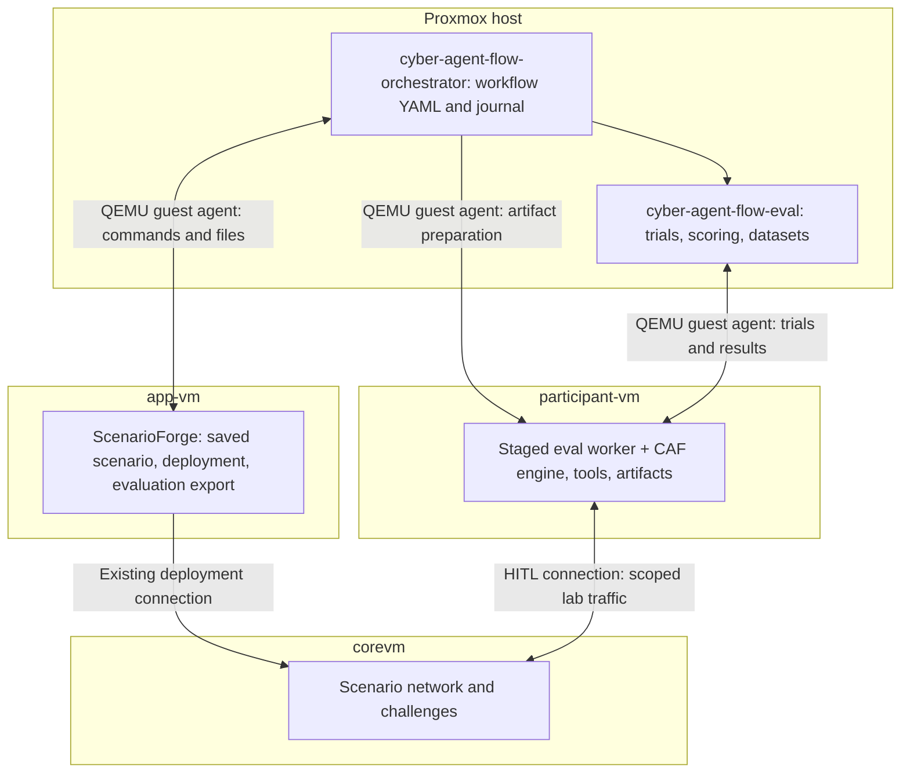

# cyber-agent-flow-orchestrator

Run a ScenarioForge → artifact preparation → evaluation workflow from the
**Proxmox host** using YAML. This project owns the lab workflow;
`cyber-agent-flow-eval` owns the trials, scoring, and datasets; `cyber-agent-flow`
owns the shared agent engine, tools, and artifact generation/testing.


See [diagram notes and command examples](docs/evaluation-diagrams.md) for the
software boundaries, comparison controls and limitations shown in these figures.



There is no direct app-vm ↔ participant-vm connection required. The host retrieves
the export and stages only participant inputs through guest-agent control. Private
verifiers and the complete attack graph stay in app-vm/host evaluation storage.
The host deliberately bridges files across these guest boundaries; treat host
storage and logs as evaluator-private.

The evaluator remains usable by itself, including its existing local and Proxmox
backends. The orchestrator depends on the evaluator's host integration API;
the evaluator never imports this project. The full evaluator coordinator runs on
the host in this setup. Only its thin worker and the main CAF engine run in the
participant VM.

## Install

Use Python 3.10+ and `uv` on the Proxmox node, with permission to run
`qm guest exec` for these VMs (normally root). For first-time installation:

```bash
cd /opt/cyber-agent-flow-orchestrator
python3 install.py
```

If the sibling `../cyber-agent-flow-eval` checkout is missing, the installer asks:

```text
Download cyber-agent-flow-eval and continue installation? [y/N]
```

Answering yes downloads it, then runs `uv sync`. Answering no stops installation.
An existing evaluator checkout is reused without fetching, pulling or overwriting
local changes. An existing incomplete directory is left untouched and reported.
The installer uses only Python's standard library, so it runs before dependencies
are installed. `git` is needed only when downloading the missing evaluator.

Bare `uv sync` has no interactive bootstrap hook for a missing local dependency;
use `install.py` for the prompt. Once the sibling checkout exists, ordinary
`uv sync` continues to work. Installing an evaluator package elsewhere does not
satisfy the configured local checkout dependency.

The download defaults to `https://github.com/raistlinJ/cyber-agent-flow-eval.git`
at `main`. To use another repository or compatible revision:

```bash
python3 install.py --eval-url https://github.com/your-org/cyber-agent-flow-eval.git --eval-ref YOUR_REF
# Unattended installation: explicitly authorize a missing checkout download.
python3 install.py --yes
# Optional uv sync arguments go after --:
python3 install.py -- --group dev
```

After `uv sync`, the installer imports the evaluator host API and orchestrator
startup modules before reporting success. A package version alone is insufficient:
`integration.py`, `reporting.py`, and Proxmox authorization support must be present.
If the check fails, update the evaluator source checkout to a compatible revision;
rerunning `uv sync` cannot restore files absent from that checkout.

These repository/ref options affect new downloads only. Existing checkouts are
never updated automatically. A failed download is removed so you can retry; a
successful checkout is retained if dependency syncing later fails. Noninteractive
installs with a missing checkout require `--yes`. This helper uses the standard
sibling layout; for custom `[tool.uv.sources]` paths, prepare that checkout and run
`uv sync` directly. The ScenarioForge provisioner already installs both projects.

`uv.lock` records dependency versions, and `tool.uv.sources` selects the sibling
evaluator checkout. Development dependencies are excluded by default; use
`uv sync --group dev` for tests. `--locked` is optional when you want to reject
lockfile updates. The existing pip editable-install workflow is also supported.

After syncing, start the WebUI with:

```bash
uv run cyber-agent-flow-orchestrator
```

No subcommand means `serve`. First launch creates editable `workflow.yaml`,
`runtime.yaml`, `catalogs/baseline.json`, and `web.yaml` in the current directory
when absent. Results default to `runs/` there. Continue launching from that same
directory to retain settings and per-user workspaces.

The web defaults are **https://localhost:8443**, PVE login at the host's FQDN on
port 8006, `/etc/pve/pve-root-ca.pem`, and the `caf-orchestration` group. Use the
existing SCE-web enrollment operation or [PVE group setup](docs/pve-login.md).
Users select their authorized VM roles after login; starting the server does not
launch experiments. The generated workflow/runtime are example templates: review
the export path, guest paths, model, network scope and shared lab lock before running
an experiment. Their example VM IDs are not assigned to PVE users.

First launch automatically creates a 365-day self-signed browser certificate at
`/certs/cert.pem` and private key at `/certs/key.pem` when both are missing. Existing
pairs are preserved; an incomplete pair requires correction. Run as the Proxmox
host account that can manage `/certs` and run `qm` (normally root). `uv sync` itself
only installs dependencies; application setup runs on first launch. The
ScenarioForge provisioner also creates these certificates at installation time.

All overrides remain available, and explicit paths must already exist:

```bash
uv run cyber-agent-flow-orchestrator serve my-workflow.yaml --web-config my-web.yaml --runs-root /srv/caf/runs
# Options alone also imply serve:
uv run cyber-agent-flow-orchestrator --runs-root /srv/caf/runs
```

Edit `web.yaml` if your PVE API uses another hostname or a publicly trusted
certificate (omit `auth.ca_file` for system trust). For access from your workstation:

```bash
ssh -N -L 8443:127.0.0.1:8443 root@YOUR_PROXMOX_HOST
```

Open **https://localhost:8443**. Trust the generated certificate or replace the
`/certs` pair with a signed chain/key and restart. Keep the key mode `0600`.

This requires the updated evaluator (0.4.2+) from this workspace. Neither project
needs to be installed as a coordinator inside a guest. ScenarioForge belongs in
app-vm; CAF and its environment belong in participant-vm. Guests need Python 3,
enabled QEMU guest agents, and Linux/systemd 250+ for transient commands. The
ScenarioForge provisioning scripts enable guest-agent integration; verify it is
working on your actual guests. macOS, other Linux hypervisors, and Windows guest
integration remain explicit **unimplemented placeholders**, not SSH fallbacks.

For those future local macOS/Linux/Windows deployments, the WebUI will run on
loopback without requiring PVE/realms, login, or the HTTPS proxy. This is a planned
local deployment mode; the current `serve` command still requires HTTPS and login.
See the [recorded local deployment requirements](docs/interfaces.md#planned-local-desktop-deployment).

## Reuse ScenarioForge provision settings

Pass the same Proxmox `.conf` file used to provision the lab:

```bash
uv run cyber-agent-flow-orchestrator --provision-config /root/scenarioforge-lab.conf
```

This imports VM IDs and nonempty LLM provider/model settings into a separate
editable profile, then starts the WebUI. Existing settings and certificates are
preserved. On first login, imported VM roles are initialized only for VMs the user
can access; existing saved role choices take precedence. Evaluation scope, scenario
selection and tasks remain in the experiment configuration.

To create a named profile for editing and CLI experiments:

```bash
uv run cyber-agent-flow-orchestrator import-provision /root/scenarioforge-lab.conf --output profiles/my-lab
uv run cyber-agent-flow-orchestrator serve profiles/my-lab/workflow.yaml
```

See [provision configuration import](docs/provision-config.md) for mappings,
precedence, custom workflow templates and experiment commands.

## Run simple workflows

Edit VM IDs, paths, model endpoint, and network scope in `examples/runtime.yaml`.
Its `engine.path` and `engine.python` are **participant guest paths**. Catalog and
guidance paths are **host paths relative to the runtime YAML**, unless collected
from the participant by the workflow. Workflow `runtime` is relative to workflow
YAML. Use the same absolute `execution.target_lock` in all configurations that
share a lab, including standalone evaluator runs.

**1. Evaluate an existing, ready export.** Set the ZIP path in app-vm. No manual ZIP
transfer is needed and the scenario is not redeployed:

```bash
.venv/bin/cyber-agent-flow-orchestrator plan examples/01-reuse-export.yaml
.venv/bin/cyber-agent-flow-orchestrator run examples/01-reuse-export.yaml --output runs/reuse-001
```

**2. Deploy a saved scenario, export, and evaluate.** Set the saved XML and scenario
name in the app VM. The scenario must already have a resolved chain. The
ScenarioForge account needs permission to write `output_root`:

```bash
.venv/bin/cyber-agent-flow-orchestrator plan examples/02-deploy-evaluate.yaml
.venv/bin/cyber-agent-flow-orchestrator run examples/02-deploy-evaluate.yaml --output runs/deploy-001
```

This invokes ScenarioForge's real CLI with `execute --xml … --scenario …
--evaluation-export --evaluation-output-dir … --suite-id …`. Its normal deployment
behavior applies to the selected lab. A unique output directory is used per
workflow. The host reads `EVALUATION_PACKAGE_JSON`, requires passing readiness,
and verifies that the downloaded package hash matches that export. Optional
`scenarioforge.tasks` selects a reviewed guest JSON task file; `split` defaults to
`development`. The orchestrator does not independently invent or plan a scenario.
Use optional `prepare` commands for an existing scenario creation/planning script.

**3. Generate/test artifacts, then compare against a baseline.** The third example
is a template requiring your generation wrapper in participant-vm:

```bash
.venv/bin/cyber-agent-flow-orchestrator plan examples/03-generate-test-evaluate.yaml
.venv/bin/cyber-agent-flow-orchestrator run examples/03-generate-test-evaluate.yaml --output runs/artifacts-001
```

`artifacts` commands execute in order. This example calls a **user-provided**
`/opt/experiments/generate-lab-helper.py`, then CAF's existing
`gen-tool_tests.py run lab_helper`. CAF currently has no general artifact-generation
CLI; the wrapper must call your configured CAF generation workflow, publish the
helper and export a native catalog. This project does not supply that wrapper or
silently automate GUI approvals. Configure any required credentials with a guest
`environment_file`, and build the CAF Docker test image separately. A nonzero
exit from generation or testing stops the workflow before evaluation.

The resulting catalog must contain the baseline tools plus `lab_helper`:

```json
{"tools": [{"name": "lab_helper", "command": "/opt/cyber-agent-flow/venv/bin/python", "base_args": ["/opt/experiments/lab_helper.py"], "allow_args": true}]}
```

That snippet illustrates the added entry; retain all baseline entries in the
actual collected catalog. Executables stay at the referenced guest paths.
`collect.added-helper` replaces only that condition's catalog/guidance with frozen
host copies. The baseline stays unchanged. Generation runs once before the
condition comparison; it is not repeated for each trial. Changing the artifacts
requires a new workflow output directory.

For one exported task, examples 1/2 schedule **2 trials** (1 condition × 2
repetitions); example 3 schedules **4 trials** (2 conditions × 2 repetitions).
Multiple tasks multiply these counts. Each attempt uses one task prompt, up to
20 engine turns, and a 300-second wall budget from the example runtime. A turn
budget is not an exact prompt/response count; tool use can add model calls. The
evaluator records the actual calls and progress checkpoints.

## Basic WebUI: live lab monitor

The dashboard requires **HTTPS and login**. On Proxmox, use the default launch
above. For an explicitly configured local account instead of PVE login:

```bash
uv run cyber-agent-flow-orchestrator create-user --file .local/users.json --username admin
uv run cyber-agent-flow-orchestrator serve examples/02-deploy-evaluate.yaml --runs-root runs --web-config examples/web.local.yaml
```

Open **https://localhost:8443**. First launch creates the configured self-signed
certificate; trust it explicitly for local use or configure your lab CA certificate.
For direct LAN access, configure `examples/web.lan.yaml` with your host and matching
certificate. No nginx/Caddy installation is required. There is no default password.

For **existing Proxmox accounts**, use [PVE login setup](docs/pve-login.md) and
[web.pve.yaml](examples/web.pve.yaml). Membership in the configured PVE group
(`caf-orchestration` in the example) grants the application's `orchestrator` role.
PVE validates passwords/TOTP; group removal revokes access on the next protected
request. Host commands still use the backend's Linux permissions.
The ScenarioForge Proxmox installer creates a self-signed certificate on first
installation at `/certs/cert.pem` and `/certs/key.pem`; the PVE/LAN web configs read
those paths. Existing pairs are preserved. Replace them with a signed certificate
chain and matching key later, keep the key mode `0600`, and restart the WebUI.

The dashboard shows VM power, guest-agent access, application presence, process
commands and elapsed time, unfinished workflow jobs, and saved experiment status.
In PVE mode, users select their own VMs and see only their own saved runs.
Execution/recovery/export remain CLI operations.

See [HTTPS/login setup](docs/https-login.md) and the
[WebUI configuration, screenshot and status definitions](docs/webui.md).

## Multiple PVE users

PVE mode now shows each user their available QEMU VMs on the current node. Select
ScenarioForge, Cyber-agent-flow, and CoreVM in **Choose your lab VMs**, then save.
Each account has its own selections, monitor cache and private run workspace.
Ordinary templates start with empty role selections. Provision-import profiles
can initialize authorized roles once; existing saved selections always win.

Eligibility requires both membership in `caf-orchestration` and effective
`VM.Audit` access to the VM. Existing pool/group ACLs are resolved by PVE. The
orchestrator group deliberately authorizes host-mediated guest operations on that
visible VM set; it does not grant native `VM.Monitor` or administrator privileges
in PVE. Only enroll users intended to have this additional guest control.
Every host command checks the authenticated user's current group, VM permission
and local-node placement again. Revocation or PVE failure blocks further commands.

Use authenticated CLI commands for runs that should appear in a user's dashboard:

```bash
# Run from the Proxmox service/operator account, in the orchestrator checkout.
# Prompts for the user's PVE password and TOTP when required; no password flags.
uv run cyber-agent-flow-orchestrator user-run \
  examples/02-deploy-evaluate.yaml \
  --username researcher@pve --web-config examples/web.pve.yaml \
  --runs-root /root/caf-lab/runs --run-id experiment-001

uv run cyber-agent-flow-orchestrator user-resume \
  --username researcher@pve --web-config examples/web.pve.yaml \
  --runs-root /root/caf-lab/runs --run-id experiment-001

uv run cyber-agent-flow-orchestrator user-recover \
  --username researcher@pve --web-config examples/web.pve.yaml \
  --runs-root /root/caf-lab/runs --run-id experiment-001
```

Use the **same absolute `--runs-root` as `serve`**. Host templates still specify
scenario paths, model settings, catalogs, policies and guest commands. `user-run`
substitutes the account's selected VM IDs into the template's app/participant/core
roles and matching guest command/hook IDs, validates all remaining VM IDs, and
freezes the inputs for that run. Changes to role selections affect subsequent
runs; resume uses the saved inputs and rechecks permissions. Shared target and
per-VM locks remain in effect. Configure ScenarioForge's own CORE connection for
the selected lab; choosing CoreVM does not rewrite ScenarioForge credentials.

The host process still needs `qm` privileges. These commands do not grant a PVE
user a root shell. The existing `run`, `resume`, `recover` and inspection commands
remain trusted host-administrator interfaces, outside PVE user authorization.
Unowned legacy runs are hidden from the PVE WebUI. Local-account mode retains its
original shared administrator dashboard; multi-user isolation requires PVE mode.
The browser can launch two bundled samples and lets the owner open results by
clicking their run. See [WebUI samples](#run-bundled-samples-in-the-webui). User workspaces and all collected
artifacts remain private on the host under `RUNS_ROOT/_users/<owner-hash>/` (0700).
Project sharing is not implemented; access is owner-only. PVE users who share a VM
can observe its processes; private host results do not isolate workloads inside
that shared guest. See [PVE authorization details](docs/pve-login.md).

## Update applications in the VMs

The WebUI's **Application versions** section can check, update and roll back
Cyber-agent-flow in the participant VM and ScenarioForge in the app VM. Source is
downloaded on the host and transferred through the guest agent; no guest internet
or app-to-participant connection is required. Updates preserve local runtime data
and use the existing Python environment. Changed dependency manifests or conflicting
local edits block activation.

If an application is running, **Check version** lists its blocking PIDs. Choose
**Stop processes and update** to review and confirm that list. The updater requests
a graceful stop before activation; it never force-kills a process. Listed terminals
may close, and unmanaged applications must be restarted manually afterward.

Version checks use ordinary VM access. Updating/rolling back additionally requires
the `caf-maintainers` PVE group. Choose a branch, tag or commit and follow the
background job on the page. `updates: false` in `web.yaml` disables the feature.
See [setup, source configuration, CLI and recovery](docs/application-updates.md).

## Run bundled samples in the WebUI

Sign in with PVE, select your **Cyber-agent-flow** participant VM, and **Save VM
roles**. Under **Try an experiment**, click **Run sample**. Nothing needs to be
imported: the bundled catalogs, prompts and demo fixture are included in the
orchestrator package. ScenarioForge and CoreVM may remain unselected for these samples.

| Sample | Runs | What it checks |
| --- | --- | --- |
| Model smoke test | 1 trial; up to 3 turns / 120 seconds | Supplied port observation, no tools; checks the worker, model and JSON scoring |
| Tools vs. added helper | 6 trials; up to 12 turns / 120 seconds each | Three repetitions of baseline `nmap`, `curl`, `python3` versus those same tools plus `http_flag_walk`; recover two flags from a temporary loopback site |

The turn counts are upper bounds, not a fixed number of prompt/response pairs.
The configured model makes real calls and can fail or time out. The HTTP helper
is a **hand-authored example artifact**; this sample does not generate a new tool
or establish that generated artifacts help on real ScenarioForge scenarios.

Requirements: a running Linux participant with QEMU guest agent, systemd, Python 3,
the configured CAF engine and guest account. The HTTP sample also checks that
`nmap`, `curl` and `python3` are available to that account. The samples inherit the
workflow runtime's `engine`, `model`, guest user and paths; verify your model
endpoint/name and credentials first. Selecting a VM does not install these pieces
or change the configured model. Provision import can supply these settings.

The orchestrator starts the demo site automatically on `127.0.0.1` at a free port
inside the participant, uses a fixed loopback-only sample policy and removes the
service afterward. It does not run scenario reset hooks. The baseline catalog is
identical in both conditions; only the helper is added. Each run saves its own
YAML, catalogs, manifest, attempts and scored datasets in your private host workspace.

Watch **Experiment runs**, then click a run to see condition scores and timings,
raw results and **Download CSV**. Preparation errors are also visible there.
One sample may run per account, with two workers per server; evaluator locks
prevent simultaneous evaluation in the same participant. See [sample lifecycle
and recovery](docs/webui.md#sample-lifecycle-and-recovery).

To remove a sample, list only the IDs you want in `web.yaml` and restart:

```yaml
samples: [smoke]  # Or [smoke, tools-vs-helper], the default when omitted
# samples: []    # Hide all sample controls and reject all sample launches
```

Disabling samples preserves saved results. Sample execution is available in PVE
mode; the local-account dashboard remains a shared monitor. General workflow
imports, arbitrary browser commands and artifact generation controls are not part
of this sample picker.

## Manage runs and inspect results from the CLI

Both projects provide installed console commands and `python -m` entry points:

```bash
.venv/bin/cyber-agent-flow-orchestrator --help
.venv/bin/python -m cyber_agent_flow_orchestrator --help
.venv/bin/cyber-agent-flow-eval --help
```

The orchestrator CLI now covers planning, execution, inspection and results export:

| Command | Purpose |
| --- | --- |
| `[serve] [CONFIG] [--web-config WEB_YAML] [--runs-root runs]` | Start the HTTPS/login-protected WebUI; no arguments uses editable defaults |
| `import-provision FILE --output DIR [--workflow CONFIG]` | Create a separate profile from ScenarioForge provision settings |
| `create-user --file USERS --username NAME` | Create an account or reset with `--replace` |
| `create-cert --hostname HOST --cert CERT --key KEY` | Generate a self-signed development certificate |
| `plan CONFIG` | Validate configuration and show intended guest actions |
| `run CONFIG --output RUN` | Execute a workflow in the foreground |
| `resume CONFIG --output RUN` | Resume; accepts `--retry-steps` / `--retry-failed` |
| `recover --output RUN` | Stop/collect journaled jobs after interruption |
| `list --root runs` | List direct child workflow directories and their status |
| `status RUN` | Inspect recorded stage states, coordinator lock, and trial counts |
| `results RUN` | Show latest attempts and summaries by condition |
| `logs RUN --stage ID` | Read a collected preparation/deployment/artifact log |
| `logs RUN --trial ID` | Read collected evaluator worker and hook logs |
| `export RUN --destination DIR` | Write datasets and summaries to a new directory |

For example, after running the artifact study:

```bash
.venv/bin/cyber-agent-flow-orchestrator list --root runs
.venv/bin/cyber-agent-flow-orchestrator status runs/artifacts-001
.venv/bin/cyber-agent-flow-orchestrator results runs/artifacts-001
.venv/bin/cyber-agent-flow-orchestrator logs runs/artifacts-001 --stage artifact-test --lines 50
.venv/bin/cyber-agent-flow-orchestrator logs runs/artifacts-001 --trial trial-000001 --attempt 1
.venv/bin/cyber-agent-flow-orchestrator export runs/artifacts-001 --destination exports/artifacts-001
```

Inspection commands print JSON, make no guest/model calls, and can run from a
second terminal while the foreground workflow runs. `status.recorded_status`
comes from the journal; `coordinator_active` checks the host lock. A saved running
status with no active coordinator can indicate an interrupted process. Neither
field is a live guest health check. Inspection does not create missing runs or
rewrite datasets. Corrupt runs appear as errors in `list` without hiding other runs.

Summaries always use the **latest attempt per trial**. `--all-attempts` on
`results` or `export` includes retained retries in the returned/exported rows,
without counting retries twice in the summary. `success_rate` is successes divided
by completed attempts with a boolean verification result; inspect status counts
alongside it for timeouts/errors. Mean final score covers completed trials, while
mean progress and execution time include recorded values from incomplete trials.
Missing metrics are `null`; these are descriptive summaries, not statistical
significance tests.

Exports contain `summary.json`, `workflow-summary.json`, `dataset.jsonl` and
`dataset.csv`. They require an existing evaluation manifest, a new destination
outside the source run, and idle workflow/evaluator locks. They preserve original
attempts and cached datasets. They do not copy the suite, prompts, private verifiers,
or raw logs; result rows can still contain discovered flags, addresses and final
answers, so exports are **not redacted**.

CLI execution remains synchronous. Use Ctrl-C to interrupt the foreground
coordinator, then `recover`/`resume` as needed. Bundled WebUI samples run in background
workers. The WebUI has no remote stop, general workflow launch or resume controls.

## Shared application API and WebUI

The CLI is a thin adapter over `cyber_agent_flow_orchestrator.service`:

```python
from cyber_agent_flow_orchestrator import service

planned = service.plan("examples/01-reuse-export.yaml")
runs = service.list_runs("runs")
state = service.status("runs/reuse-001")
report = service.results("runs/reuse-001", all_attempts=False)
# Blocking execution with optional progress callback; returns an exit status.
# service.run("examples/01-reuse-export.yaml", "runs/new-run", progress=print)
```

`plan`, `list_runs`, `status`, `results`, `logs`, `export_results`, `run`, and
`recover` are reusable entry points. They return structured values (execution
returns a status code), raise exceptions rather than terminating the process, and
keep argparse out of application logic. Execution accepts a progress callback and
is quiet by default through the service API. The evaluator's
`cyber_agent_flow_eval.reporting` module owns shared trial summaries/log inspection
and result serialization. The current WebUI uses the service layer for run status
and a separate read-only monitor for guest observations. Its `SampleManager` runs
a fixed sample catalog in background workers with owner-scoped paths, CSRF checks,
per-command PVE authorization, journals and evaluator locks. See
[the service-boundary design](docs/interfaces.md).

## Workflow controls and repeatability

The sequence is `prepare` → deploy/reuse → fetch and validate export → `artifacts`
→ collect/freeze catalogs and guidance → import suite → run evaluator. Both command
lists use the same schema:

```yaml
prepare:
  - id: prepare-saved-scenario
    vmid: 9402
    user: scenarioforge
    cwd: /opt/scenarioforge
    environment_file: /opt/scenarioforge/.scenarioforge.env
    argv: [/opt/scenarioforge/.venv/bin/python, /opt/experiments/prepare-scenario.py]
    timeout_seconds: 600
```

Commands use argument arrays, not interpolated shell strings. `user`, `cwd`, and
`environment_file` are optional; omitted `user` uses the guest agent's root
context. Explicitly choose the intended account. Command definitions are trusted
operator inputs. Scripts remain in the guests; their source is not automatically
snapshotted. Pin/version your scripts and executable artifacts for stronger
reproduction. The exported scenario, selected CAF engine source, evaluator source,
host inputs, and frozen condition contents are recorded/hashed.

Reset/readiness commands belong in runtime `backend.before_trial`: they run before
**every attempt**, including retries. The orchestrator does not infer a reset,
restore VM snapshots, or refresh a stale export. Supply lab-specific reset/check
scripts that retain the exported scenario/session identity. Deploying once is not
sufficient to isolate trials that mutate targets. Network allow/disallow policy
remains solely in the CAF evaluator runtime; it is not added to ScenarioForge.

Each output contains:

- `workflow.json`: source/config identity, guest units, stage status, retained attempts.
- `logs/`: preparation/deployment/generation/test command logs.
- `suite/`: validated private ScenarioForge export.
- `inputs/`, `runtime.yaml`, `study.yaml`: frozen artifacts and resolved evaluator configuration.
- `evaluation/`: evaluator manifest, attempt evidence, `dataset.jsonl`, `dataset.csv`.

Dataset JSONL rows and the evaluator manifest include the workflow ID/hash. Scores,
partial flag progress, elapsed time, and model/tool traces remain evaluator-owned.
A completed trial can have a failing score; process completion is not a claim that
the challenge was solved.

## Resume and recovery

```bash
.venv/bin/cyber-agent-flow-orchestrator recover --output runs/artifacts-001
.venv/bin/cyber-agent-flow-orchestrator run examples/03-generate-test-evaluate.yaml --output runs/artifacts-001 --resume
# After inspecting a failed/interrupted preparation command and its guest state:
.venv/bin/cyber-agent-flow-orchestrator run examples/03-generate-test-evaluate.yaml --output runs/artifacts-001 --resume --retry-steps
# Retry failed evaluator trials without regenerating completed artifacts:
.venv/bin/cyber-agent-flow-orchestrator run examples/03-generate-test-evaluate.yaml --output runs/artifacts-001 --resume --retry-failed
```

Completed stages are skipped; frozen file/config/source changes refuse resume.
Failed/interrupted guest commands require `--retry-steps` before rerunning because
execution may already have modified the lab. It retries the command, not a rollback;
repair partial ScenarioForge output before retrying a deployment. All attempts are
retained. `recover` uses the recorded runtime even if the original configuration
has moved, stops journaled units, and collects available evidence without launching
work. Guest commands have systemd deadlines; unconfirmed cleanup blocks progress.
Guest command logs remain in `/tmp/caf-orchestrator-*.log` for recovery and may be
removed after host collection and review. Workflow results are private experiment
records; protect their host directory accordingly.

`plan` validates host inputs and lists actions; it makes no guest/model calls and
cannot validate guest files, permissions, live readiness, or generated catalogs.
Exit codes: 0 = all latest trials completed, 1 = trial execution errors, 2 =
configuration/workflow error, 130 = interrupted.

## Development and validation

```bash
.venv/bin/python -m pytest -q
../cyber-agent-flow-eval/.venv/bin/python -m pytest ../cyber-agent-flow-eval/tests -q
```

Tests exercise real suite validation/import, frozen artifacts, evaluator scoring
and provenance, shared locks, stage retry/recovery, export markers, and resume
integrity. Sample tests cover both conditions, private results/CSV, CSRF, revoked
VM access, retry IDs, shutdown cleanup and a real local HTTP fixture/helper.
`uv run --group dev python tests/browser_samples.py /tmp/caf-samples-preview`
checks both sample buttons and results in Chrome. Guest operations and model execution are simulated. A live Proxmox
end-to-end run is still required in your deployed lab; no guest deployment or model
request was performed during implementation.
