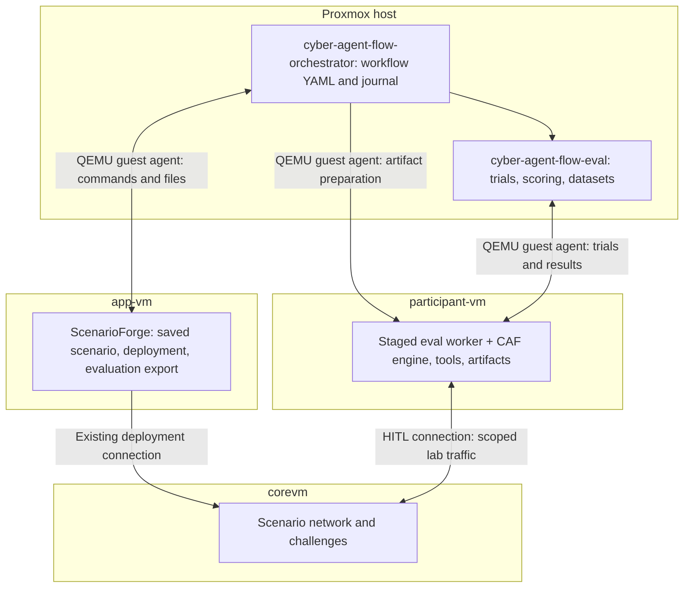

# cyber-agent-flow-orchestrator

Run a ScenarioForge → artifact preparation → evaluation workflow from the
**Proxmox host** using YAML. This project owns the lab workflow;
`cyber-agent-flow-eval` owns the trials, scoring, and datasets; `cyber-agent-flow`
owns the shared agent engine, tools, and artifact generation/testing.



There is no direct app-vm ↔ participant-vm connection required. The host retrieves
the export and stages only participant inputs through guest-agent control. Private
verifiers and the complete attack graph stay in app-vm/host evaluation storage.
The host deliberately bridges files across these guest boundaries; treat host
storage and logs as evaluator-private.

The evaluator remains usable by itself, including its existing local and Proxmox
backends. The orchestrator depends on the evaluator's host integration API;
the evaluator never imports this project. The full evaluator coordinator runs on
the host in this setup. Only its thin worker and the main CAF engine run in the
participant VM.

## Install

Use Python 3.10+ on the Proxmox node, with permission to run `qm guest exec` for
these VMs (normally root). Install the sibling repositories together:

```bash
cd /opt
# Place cyber-agent-flow-eval and cyber-agent-flow-orchestrator checkouts here.
cd cyber-agent-flow-orchestrator
python3 -m venv .venv
.venv/bin/python -m pip install -e '../cyber-agent-flow-eval[test]' -e '.[test]'
```

This requires the updated evaluator (0.2.0+) from this workspace. Neither project
needs to be installed as a coordinator inside a guest. ScenarioForge belongs in
app-vm; CAF and its environment belong in participant-vm. Guests need Python 3,
enabled QEMU guest agents, and Linux/systemd 250+ for transient commands. The
ScenarioForge provisioning scripts enable guest-agent integration; verify it is
working on your actual guests. macOS, other Linux hypervisors, and Windows guest
integration remain explicit **unimplemented placeholders**, not SSH fallbacks.

## Run simple workflows

Edit VM IDs, paths, model endpoint, and network scope in `examples/runtime.yaml`.
Its `engine.path` and `engine.python` are **participant guest paths**. Catalog and
guidance paths are **host paths relative to the runtime YAML**, unless collected
from the participant by the workflow. Workflow `runtime` is relative to workflow
YAML. Use the same absolute `execution.target_lock` in all configurations that
share a lab, including standalone evaluator runs.

**1. Evaluate an existing, ready export.** Set the ZIP path in app-vm. No manual ZIP
transfer is needed and the scenario is not redeployed:

```bash
.venv/bin/cyber-agent-flow-orchestrator plan examples/01-reuse-export.yaml
.venv/bin/cyber-agent-flow-orchestrator run examples/01-reuse-export.yaml --output runs/reuse-001
```

**2. Deploy a saved scenario, export, and evaluate.** Set the saved XML and scenario
name in the app VM. The scenario must already have a resolved chain. The
ScenarioForge account needs permission to write `output_root`:

```bash
.venv/bin/cyber-agent-flow-orchestrator plan examples/02-deploy-evaluate.yaml
.venv/bin/cyber-agent-flow-orchestrator run examples/02-deploy-evaluate.yaml --output runs/deploy-001
```

This invokes ScenarioForge's real CLI with `execute --xml … --scenario …
--evaluation-export --evaluation-output-dir … --suite-id …`. Its normal deployment
behavior applies to the selected lab. A unique output directory is used per
workflow. The host reads `EVALUATION_PACKAGE_JSON`, requires passing readiness,
and verifies that the downloaded package hash matches that export. Optional
`scenarioforge.tasks` selects a reviewed guest JSON task file; `split` defaults to
`development`. The orchestrator does not independently invent or plan a scenario.
Use optional `prepare` commands for an existing scenario creation/planning script.

**3. Generate/test artifacts, then compare against a baseline.** The third example
is a template requiring your generation wrapper in participant-vm:

```bash
.venv/bin/cyber-agent-flow-orchestrator plan examples/03-generate-test-evaluate.yaml
.venv/bin/cyber-agent-flow-orchestrator run examples/03-generate-test-evaluate.yaml --output runs/artifacts-001
```

`artifacts` commands execute in order. This example calls a **user-provided**
`/opt/experiments/generate-lab-helper.py`, then CAF's existing
`gen-tool_tests.py run lab_helper`. CAF currently has no general artifact-generation
CLI; the wrapper must call your configured CAF generation workflow, publish the
helper and export a native catalog. This project does not supply that wrapper or
silently automate GUI approvals. Configure any required credentials with a guest
`environment_file`, and build the CAF Docker test image separately. A nonzero
exit from generation or testing stops the workflow before evaluation.

The resulting catalog must contain the baseline tools plus `lab_helper`:

```json
{"tools": [{"name": "lab_helper", "command": "/opt/cyber-agent-flow/venv/bin/python", "base_args": ["/opt/experiments/lab_helper.py"], "allow_args": true}]}
```

That snippet illustrates the added entry; retain all baseline entries in the
actual collected catalog. Executables stay at the referenced guest paths.
`collect.added-helper` replaces only that condition's catalog/guidance with frozen
host copies. The baseline stays unchanged. Generation runs once before the
condition comparison; it is not repeated for each trial. Changing the artifacts
requires a new workflow output directory.

For one exported task, examples 1/2 schedule **2 trials** (1 condition × 2
repetitions); example 3 schedules **4 trials** (2 conditions × 2 repetitions).
Multiple tasks multiply these counts. Each attempt uses one task prompt, up to
20 engine turns, and a 300-second wall budget from the example runtime. A turn
budget is not an exact prompt/response count; tool use can add model calls. The
evaluator records the actual calls and progress checkpoints.

## Workflow controls and repeatability

The sequence is `prepare` → deploy/reuse → fetch and validate export → `artifacts`
→ collect/freeze catalogs and guidance → import suite → run evaluator. Both command
lists use the same schema:

```yaml
prepare:
  - id: prepare-saved-scenario
    vmid: 9402
    user: scenarioforge
    cwd: /opt/scenarioforge
    environment_file: /opt/scenarioforge/.scenarioforge.env
    argv: [/opt/scenarioforge/.venv/bin/python, /opt/experiments/prepare-scenario.py]
    timeout_seconds: 600
```

Commands use argument arrays, not interpolated shell strings. `user`, `cwd`, and
`environment_file` are optional; omitted `user` uses the guest agent's root
context. Explicitly choose the intended account. Command definitions are trusted
operator inputs. Scripts remain in the guests; their source is not automatically
snapshotted. Pin/version your scripts and executable artifacts for stronger
reproduction. The exported scenario, selected CAF engine source, evaluator source,
host inputs, and frozen condition contents are recorded/hashed.

Reset/readiness commands belong in runtime `backend.before_trial`: they run before
**every attempt**, including retries. The orchestrator does not infer a reset,
restore VM snapshots, or refresh a stale export. Supply lab-specific reset/check
scripts that retain the exported scenario/session identity. Deploying once is not
sufficient to isolate trials that mutate targets. Network allow/disallow policy
remains solely in the CAF evaluator runtime; it is not added to ScenarioForge.

Each output contains:

- `workflow.json`: source/config identity, guest units, stage status, retained attempts.
- `logs/`: preparation/deployment/generation/test command logs.
- `suite/`: validated private ScenarioForge export.
- `inputs/`, `runtime.yaml`, `study.yaml`: frozen artifacts and resolved evaluator configuration.
- `evaluation/`: evaluator manifest, attempt evidence, `dataset.jsonl`, `dataset.csv`.

Dataset JSONL rows and the evaluator manifest include the workflow ID/hash. Scores,
partial flag progress, elapsed time, and model/tool traces remain evaluator-owned.
A completed trial can have a failing score; process completion is not a claim that
the challenge was solved.

## Resume and recovery

```bash
.venv/bin/cyber-agent-flow-orchestrator recover --output runs/artifacts-001
.venv/bin/cyber-agent-flow-orchestrator run examples/03-generate-test-evaluate.yaml --output runs/artifacts-001 --resume
# After inspecting a failed/interrupted preparation command and its guest state:
.venv/bin/cyber-agent-flow-orchestrator run examples/03-generate-test-evaluate.yaml --output runs/artifacts-001 --resume --retry-steps
# Retry failed evaluator trials without regenerating completed artifacts:
.venv/bin/cyber-agent-flow-orchestrator run examples/03-generate-test-evaluate.yaml --output runs/artifacts-001 --resume --retry-failed
```

Completed stages are skipped; frozen file/config/source changes refuse resume.
Failed/interrupted guest commands require `--retry-steps` before rerunning because
execution may already have modified the lab. It retries the command, not a rollback;
repair partial ScenarioForge output before retrying a deployment. All attempts are
retained. `recover` uses the recorded runtime even if the original configuration
has moved, stops journaled units, and collects available evidence without launching
work. Guest commands have systemd deadlines; unconfirmed cleanup blocks progress.
Guest command logs remain in `/tmp/caf-orchestrator-*.log` for recovery and may be
removed after host collection and review. Workflow results are private experiment
records; protect their host directory accordingly.

`plan` validates host inputs and lists actions; it makes no guest/model calls and
cannot validate guest files, permissions, live readiness, or generated catalogs.
Exit codes: 0 = all latest trials completed, 1 = trial execution errors, 2 =
configuration/workflow error, 130 = interrupted.

## Development and validation

```bash
.venv/bin/python -m pytest -q
../cyber-agent-flow-eval/.venv/bin/python -m pytest ../cyber-agent-flow-eval/tests -q
```

Tests exercise real suite validation/import, frozen artifacts, evaluator scoring
and provenance, shared locks, stage retry/recovery, export markers, and resume
integrity. Guest operations and model execution are simulated. A live Proxmox
end-to-end run is still required in your deployed lab; no guest deployment or model
request was performed during implementation.
