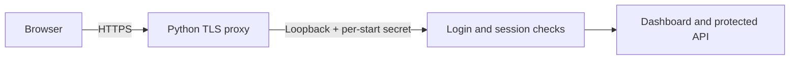
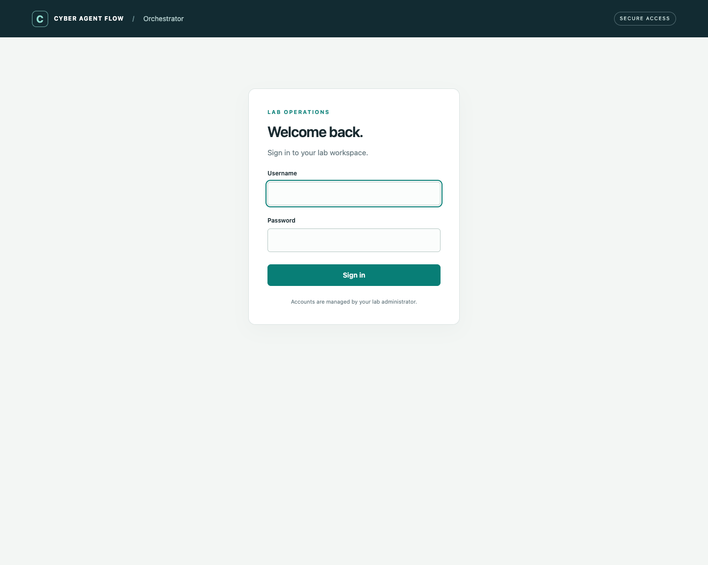

# HTTPS and login

The current WebUI requires login and runs behind a **Python HTTPS reverse proxy**.
`serve` starts both components: an aiohttp TLS listener and a private dashboard
backend on a dynamically selected loopback port. No nginx/Caddy service is needed.

These requirements describe the current implementation. Future local
macOS/Linux/Windows operation will require neither login nor the HTTPS proxy,
and will have no PVE/realm dependency. See the
[planned local deployment mode](interfaces.md#planned-local-desktop-deployment).
The local-account option below still belongs to today's authenticated server;
it is distinct from that future mode with no login.





The dashboard monitors VMs and saves PVE users’ role selections. Authentication protects its page and API;
command execution, job authorization and audit controls will be separate additions.
PVE group membership can now gate access to the dashboard.

## Install with uv

For a first installation, run the bootstrap helper from the orchestrator checkout:

```bash
cd cyber-agent-flow-orchestrator
python3 install.py
```

The helper asks before downloading a missing sibling `cyber-agent-flow-eval`
checkout and then runs `uv sync`. Existing checkouts are preserved; declining stops
installation. Use `--yes` to authorize the download in noninteractive installations,
or `--eval-url` / `--eval-ref` for another repository or revision. These switches
never update an existing checkout. With both projects already present, bare
`uv sync` remains supported. The prompt belongs to `install.py`, not uv itself.

`pyproject.toml` declares runtime dependencies, `uv.lock` pins their resolved
versions, and `[tool.uv.sources]` selects the sibling evaluator as an editable local
package. Both checkouts are required; the evaluator version must be 0.4.0 or later.
For a different directory layout, change that source path and regenerate the lock
with `uv lock`. No requirements.txt or JavaScript build step is required.

For development and tests, use `uv sync --group dev`.
`uv run …` avoids installing test/browser dependencies on the
Proxmox host. See uv's [locking and syncing documentation](https://docs.astral.sh/uv/concepts/projects/sync/).

For existing Proxmox accounts, use [PVE login and group-based access](pve-login.md)
instead of creating local users. Local authentication remains available for other
environments.

## First local login

Create a user interactively. There is no default account or password:

```bash
uv run cyber-agent-flow-orchestrator create-user --file .local/users.json --username admin
```

The command prompts twice without echoing the password. Passwords must have at
least 12 characters and are stored as Argon2id hashes. The JSON file is published
with owner-only permissions; plaintext passwords are not stored, passed as CLI
arguments, or printed. `.local/` and PEM/key files are ignored by Git.

The first launch creates a self-signed certificate and owner-only private key
at the paths in your web configuration, if both files are absent. Existing pairs
are preserved. Trust this certificate on your workstation for local use, or supply
a certificate from your lab CA.

Start the authenticated dashboard:

```bash
uv run cyber-agent-flow-orchestrator serve examples/02-deploy-evaluate.yaml --runs-root runs --web-config examples/web.local.yaml
```

Open **https://localhost:8443** and sign in. Use that exact origin, matching
`public_url`. For a workstation tunnel to a loopback-only Proxmox listener:

```bash
ssh -N -L 8443:127.0.0.1:8443 root@YOUR_PROXMOX_HOST
```

Then open **https://localhost:8443** on the workstation. The tunnel does not replace
HTTPS or login. Guest operations still use the QEMU guest agent.

## Automatic certificates

Every server launch creates a self-signed certificate/key when both configured
files are absent, valid for 365 days and including the public URL hostname,
localhost, loopback addresses and the machine hostname/FQDN. An existing pair is
preserved; an incomplete pair stops startup. With no web config override, the
paths are `/certs/cert.pem` and `/certs/key.pem`. The local example uses `.local/tls/`.
`create-cert` remains available for explicit SAN/lifetime choices.

`uv sync` installs dependencies only. Certificate creation occurs on first launch,
or during a ScenarioForge provisioner installation. `uv run cyber-agent-flow-orchestrator`
starts with PVE defaults; see [PVE setup](pve-login.md).

## Direct LAN access

The Proxmox provisioner creates a self-signed pair in `/certs` on first install
and preserves it on later installs. The PVE and LAN examples read
`/certs/cert.pem` and `/certs/key.pem`. Replace those files with a CA-issued PEM
chain and matching private key, keep the key mode `0600`, and restart `serve` to
switch certificates. See [PVE setup](pve-login.md) for manual installation.
The local development example continues to use `.local/tls/`.

Use [web.lan.yaml](../examples/web.lan.yaml) and set `public_url` to the DNS name
(or IP address) your browser will use. Configure a matching trusted certificate:

```yaml
version: 1
listen: 0.0.0.0
port: 8443
public_url: https://orchestrator.lab:8443
certificate: /certs/cert.pem
private_key: /certs/key.pem
users_file: /etc/caf-orchestrator/users.json
session_idle_seconds: 1800
session_max_seconds: 28800
```

The certificate SAN must match `orchestrator.lab`, and the workstation must resolve
that name to the Proxmox host. Alternatively use an IP `public_url` and a certificate
with an IP SAN. Key and account files need owner-only permissions (`chmod 600`).
The server's account must be able to read them and perform the configured Proxmox
checks. TLS uses Python's SSL context with TLS 1.2 or newer.

Start with your chosen configuration:

```bash
uv run cyber-agent-flow-orchestrator serve examples/02-deploy-evaluate.yaml --runs-root runs --web-config examples/web.lan.yaml
```

Web settings are separate from experiment YAML. Relative certificate/key/user paths
resolve against the web settings file. The public URL must be an HTTPS origin with
no path, user information, query or fragment; its port must match the listener.
Only that Host/Origin is accepted. Restart `serve` after changing TLS/listener
settings or renewing certificates. There is no plaintext public listener or
unauthenticated `serve` fallback. An external proxy is not required or configured
by this implementation.

## Sessions and account maintenance

- Each successful login issues a new random, opaque session token. The browser
  cookie is `Secure`, `HttpOnly`, `SameSite=Strict`, `Path=/`, with a `__Host-` prefix.
- Session records stay in server memory; restarting the server logs everyone out.
  Defaults are 30 minutes idle and 8 hours absolute lifetime. Dashboard polling
  counts as activity; the absolute limit still applies.
- Logout requires both a matching Origin and the session's CSRF token, and revokes
  the token on the server. Protected API requests without a valid session return 401.
- Password changes/removing an account invalidate its existing sessions on the
  next authenticated request for local accounts. Local accounts receive the
  `orchestrator` role. In [PVE mode](pve-login.md), that role requires membership
  in the configured PVE group, checked on every protected request; PVE TOTP is
  supported. Browser single sign-on is not implemented.
- Login attempts are limited to 8 per minute per network peer and 30 per minute
  globally, with at most two concurrent password verifications. Client-supplied
  forwarding headers cannot override the network peer used for throttling.

Add another user or reset a password:

```bash
uv run cyber-agent-flow-orchestrator create-user --file .local/users.json --username researcher
uv run cyber-agent-flow-orchestrator create-user --file .local/users.json --username admin --replace
```

Authentication runs inside the private backend as well as enforcing the proxy
boundary. The backend requires a random per-start proxy secret that is never
forwarded to the browser. Knowing its loopback port or supplying spoofed
`X-Forwarded-*` headers does not grant access. The proxy forwards only to that fixed
backend and uses no shared browser-cookie jar. POST requests enforce same-origin
and CSRF checks before any authenticated action; currently logout and PVE VM-role selection use these checks. Login uses same-origin checks before creating a session.

The password implementation uses the maintained
[argon2-cffi PasswordHasher](https://argon2-cffi.readthedocs.io/en/stable/api.html).
The proxy uses [aiohttp](https://docs.aiohttp.org/en/stable/client_reference.html)
with a fixed upstream and redirects disabled. It does not provide a generic open
proxy or expose execution/file-browsing endpoints.

## Validation

```bash
uv sync --group dev
uv run --group dev pytest -q
# Chrome required; generated test certificate trusted only within the test client:
uv run --group dev python tests/browser_smoke.py /tmp/caf-auth-preview
```

Automated checks exercise real TLS requests through the proxy to the backend,
certificate trust, login failures/throttling, secure cookie attributes, per-client
session isolation, idle/absolute expiry, logout/CSRF, password rotation, proxy
bypass, origin/Host checks, oversized requests and protected dashboard access.
Browser checks also cover login/logout and desktop/mobile dashboard behavior.
Only isolated browser tests bypass trust for their temporary self-signed test
certificate; the TLS integration tests explicitly validate the test certificate.
No credentials or certificates are generated into the repository by tests.

First-run checks also cover no-argument/implicit `serve`, valid generated workflow
and PVE settings, preservation of existing files, refusal of missing explicit
configuration paths and incomplete certificate pairs, packaged templates, and an
actual CLI launch serving HTTPS with a newly generated certificate. These are
local tests; default PVE authentication has not been tested on a live Proxmox node.
