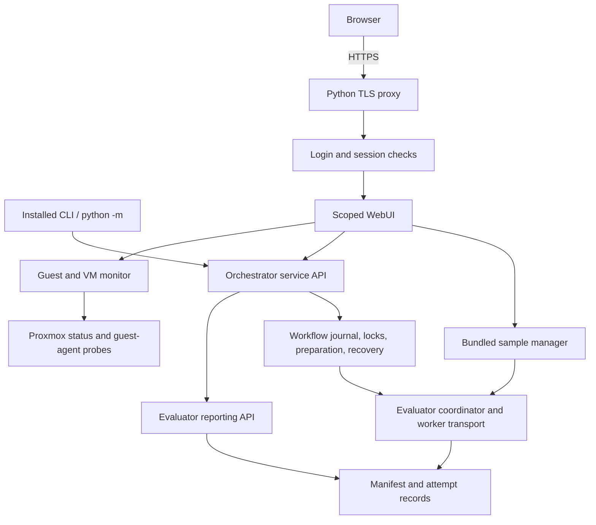

# CLI and WebUI boundary

The CLI and a WebUI with PVE VM-role selection and monitoring are available. Both use application services
rather than invoke each other's command lines. Browser execution supports a bundled sample catalog and scoped application
maintenance through background workers. See [the dashboard guide](webui.md).

`cyber_agent_flow_orchestrator.service` owns workflow operations, inspection and
export. `cyber_agent_flow_eval.reporting` owns trial record selection, metrics,
collected logs and result serialization. The CLI owns argparse, JSON rendering,
progress printing and exit codes. Neither service layer imports argparse or exits
the process. Inspection is read-only; exports and execution explicitly acquire
locks. Long-running execution is blocking and accepts a progress callback.

The sample manager keeps HTTP handlers responsive with bounded background workers.
It uses workflow/evaluator leases and journals, owner-specific output paths, and
PVE authorization before each guest command. General workflow launch/cancellation
controls remain future work. No browser endpoint accepts arbitrary command YAML.
The Python HTTPS proxy fronts a private loopback server with mandatory login.
Both dashboard and cached status API require a session; the backend also requires
a per-start proxy secret. The sample launch endpoint is available only with PVE
authentication and a saved, currently authorized participant VM. See [HTTPS and login](https-login.md). Guest probes run
in a background polling thread, separate from HTTP requests.

Data semantics:

- Attempt JSON is authoritative; dataset files are derived exports.
- Latest attempts determine summaries. All-attempt views preserve retry evidence.
- Workflow journal status and coordinator activity are separate observations.
- Inspection during execution can reflect adjacent record updates; it is not a
  transaction across the whole run. Idle export acquires both workflow/evaluator locks.
- Result exports are analysis datasets, not a complete replay/backup package or a
  redacted participant bundle. Logs, prompts and private suite files are omitted.
- Reading a run never invokes an engine or a guest agent. Recovering one may.

Existing standalone evaluator use remains supported. The dependency direction is
orchestrator → evaluator → configured CAF engine. The evaluator does not depend on
the orchestrator or a future web framework.

## Planned local desktop deployment

When the macOS, non-Proxmox Linux, and Windows backends are implemented, the
orchestrator must support running locally for the current OS user without PVE
accounts, realms, groups, or a PVE connection. This local mode must not require
login, an account file, TLS certificates, or the Python HTTPS reverse proxy.
The browser will connect directly to a loopback-only local WebUI; host operations
will use the launching OS account's permissions.

Authentication and the HTTPS proxy are deployment concerns, not requirements of
the shared orchestrator/evaluator engine or every VM backend. Keep the PVE
authentication provider and group-to-role mapping specific to deployments that
select them. Select local versus shared/networked access explicitly, independently
of OS or hypervisor selection: Linux can host either a local application or PVE.
Local mode is not an automatic fallback when PVE authentication fails.

This is a recorded implementation requirement, not an available mode yet. The
current `serve` command still requires HTTPS and login. Existing Proxmox behavior
is unchanged; future shared/networked deployments retain explicit authentication
and HTTPS configuration.

## PVE user scope

PVE mode uses `UserDashboard`, canonical-identity workspaces and `PVEAccess`.
`GET /api/status` returns only that account's available local VMs, role selections
and private runs; `POST /api/roles` validates the session, CSRF and every selected
VM. `GET /api/runs/{id}/status` and `/results` resolve IDs only beneath the session
owner's runs directory. The browser cannot submit an owner or host path.

The authenticated `user-run`, `user-resume` and `user-recover` CLI commands use
`authorized_operations` from the evaluator's Proxmox transport. The callback is
captured by each GuestAgent and runs before every qm subprocess. PVE permissions
are checked at dispatch, not just when a workflow starts. Trusted administrator
CLI calls and standalone evaluator calls can still use the transport without a
user context. `SampleManager` also establishes `authorized_operations` inside each
background worker; it does not call the unrestricted administrator workflow API.

`POST /api/samples/run` accepts exactly `sample_id` and a 32-hex-character
`request_id`, requires same-origin/CSRF checks, and returns HTTP 202 with a private
run ID. Disabled IDs are rejected server-side. Repeated IDs return the existing
run, and capacity conflicts return 409. `GET /api/runs/{id}/dataset.csv` resolves
only beneath the requesting owner's workspace. The proxy preserves its download
header. Model answers and trial files remain in the evaluator's normal format.

## Application maintenance

`POST /api/applications` accepts exactly `role` (`participant` or `scenarioforge`),
`action` (`inspect`, `update`, `rollback`), `ref` and `request_id`. The role resolves
to the account's saved VM; paths, service names and repository URLs come only from
administrator configuration. Requests require PVE login, same-origin and CSRF
checks. Update/rollback additionally recheck `updates.group` membership before
each guest dispatch. Inspection uses ordinary scoped VM access.

`UpdateManager` runs bounded background workers and persists private job records
under the owner's workspace. `/api/status` includes those records and maintenance
capabilities. `user-app` invokes the same manager. The host packages Git objects;
`update_guest.py` stages and validates the release, coordinates service state and
source checkout, and records rollback/recovery state. Host target/VM leases plus
the evaluator's shared guest maintenance guard serialize updates with launches.
See [application update behavior and limits](application-updates.md).
