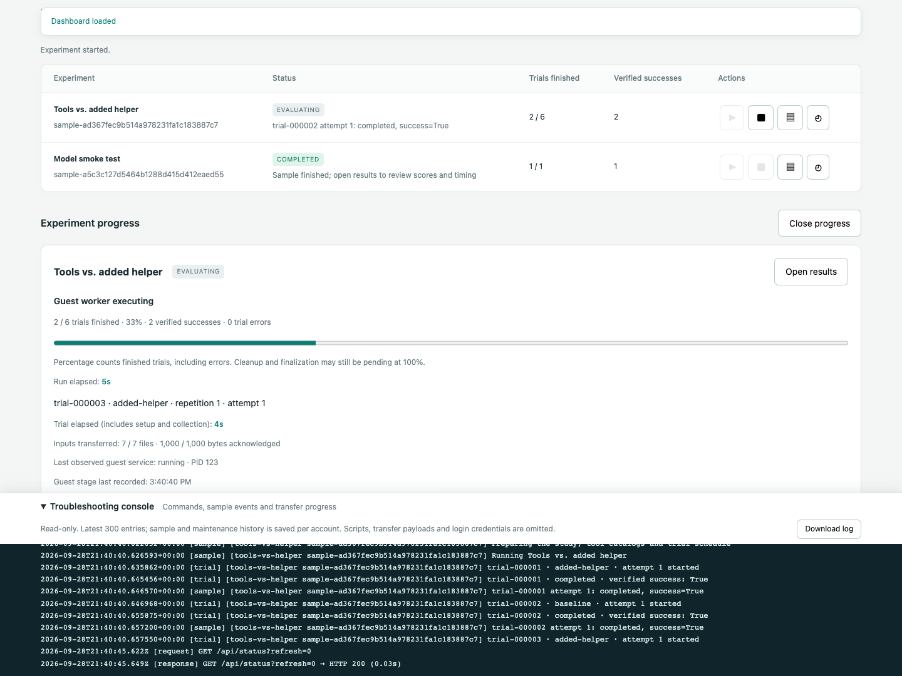

# Live lab dashboard

The WebUI monitors labs and saves per-user VM role selections in PVE mode.
It can launch [two bundled samples](../README.md#run-bundled-samples-in-the-webui)
and download their CSV datasets. Use the CLI for full workflows, resume, recovery
and other exports. The page shows VM availability, application presence,
process commands and elapsed time, unfinished workflow jobs, and saved run status.


The screenshot uses simulated data for browser verification, not a live Proxmox run.

## Pages and navigation

- **Overview** (`/#overview`): VM power, guest-agent access, application processes,
  elapsed time and unfinished workflow commands. Links lead to setup, experiments
  and application maintenance.
- **Experiments** (`/#experiments`): an experiment table with Run, Stop, View results
  and Open progress icons. **New** opens a sample configuration modal. Condition
  summaries and CSV downloads are available in results; full JSON is under
  **Full result details**.
- **Applications** (`/#applications`): version checks, Update with process-stop
  confirmation, rollback and the latest maintenance outcome. Expand **Maintenance
  history** for older jobs, transfer details and diagnostic records.
- **Lab setup** (`/#setup`): saved per-user VM roles and automatic refresh preferences.
  Local-account mode continues to use VM roles from the workflow configuration.

Navigation stays available during loading and maintenance. Switching pages does
not restart checks, submit changes, clear the console, or discard unsaved form
selections. The current page supports bookmarks, reload and browser Back/Forward.
Unsaved edits persist across page navigation, not a full browser reload. Loading
and maintenance status stays visible across pages; mutation controls retain their
existing busy and permission checks. Configure VM roles first, check application
compatibility on Applications, then run samples on Experiments.

## Start it

On the Proxmox host, after `uv sync`:

```bash
uv run cyber-agent-flow-orchestrator
```

This defaults to `serve`, `workflow.yaml`, `web.yaml`, and `runs/` in the current
directory. Missing default configuration files are created once; missing
certificate pairs are generated on first launch in `/certs`. PVE login is the
default, using the host FQDN, Proxmox CA and `caf-orchestration` group.
Use [PVE login](pve-login.md) to enroll accounts, then choose VM roles in the page.
For local accounts instead, follow [HTTPS and login setup](https-login.md).
Explicit overrides remain supported:

```bash
uv run cyber-agent-flow-orchestrator serve examples/02-deploy-evaluate.yaml --runs-root runs --web-config examples/web.local.yaml
```

Open **https://localhost:8443** and sign in. For direct LAN access, use
`examples/web.lan.yaml` with your hostname and certificate. Loopback access through
an SSH tunnel remains available. TLS and authentication are mandatory in both modes;
the previous unauthenticated HTTP `serve --port` interface has been removed.
The backend remains loopback-only and accepts requests only from its paired proxy.

For future local macOS/Linux/Windows operation, a direct loopback WebUI without
PVE, login, or the HTTPS proxy is planned. It is not implemented yet; see the
[local deployment requirements](interfaces.md#planned-local-desktop-deployment).

The selected workflow YAML and its runtime must validate. `--runs-root` is a host
path relative to the current working directory; it need not exist until you start
a run. The workflow YAML supplies a template; PVE users choose their VM roles
in the page, while local-account mode uses the configured VM IDs. Starting the
WebUI does not start experiments or VMs. Stopping it asks sample workers to finish
the current bounded trial and clean up; independent CLI runs are unaffected.
Use a second terminal for ordinary CLI runs. Restart the WebUI after editing its
configuration.

To reuse ScenarioForge VM IDs and model settings, add
`--provision-config /path/to/scenarioforge-lab.conf`. This creates a separate
profile and initializes eligible roles once per user; saved selections are
preserved. See [provision import](provision-config.md).

## Loading and progress

The login form locks its fields and buttons while authentication is pending, and
keeps them locked while navigating after success. Duplicate submissions are
ignored. The dashboard verifies its session before requesting VM status.

During initial/manual dashboard retrieval and VM checks, role saves, result loading
and application maintenance, edit/submit/refresh controls are disabled. Scheduled
background refreshes keep controls usable. If you submit an action during an
in-flight background read, it waits for that read before dispatching; duplicate
submissions are blocked. A status banner shows the
current step and elapsed time. VM-check percentages count finished checks for the
currently authorized selected VMs (for example, 1 of 3 is 33%); they are not an
estimate of remaining time or a claim that every VM is healthy. Authentication,
HTTP requests and maintenance operations use an indeterminate indicator and their
current status because their total work is unknown. Maintenance details remain
readable while an operation is active.

Manual **Refresh view** starts fresh VM checks in PVE mode. **Lab setup → Automatic refresh**
offers Never or every 1, 2, 5, or 10 minutes, defaulting to 1 minute. The preference
is saved in this browser and can be changed while a check is running. Never stops
idle polling; it does not cancel a check or job already started. Active checks,
maintenance and experiments continue reporting progress every five seconds until
finished. These progress reads do not start another VM check in PVE mode.
Automatic reads do not overlap, and polling pauses during a save or other
foreground action. On a request
failure, controls unlock for retry; temporary service errors do not themselves
send the user back to login. A confirmed expired session still requires login.
Experiment jobs continue in the background with their existing run controls.

## Application versions

On **Applications**, use **Check version**, **Update** and **Roll back** for the selected CAF and
ScenarioForge VMs. Updating/rolling back requires the `caf-maintainers` PVE group;
checking versions uses ordinary VM access. Updates run in background workers and
preserve local data. See [application maintenance](application-updates.md) for
setup, dependency limits, service restarts, source repositories and recovery.

## Troubleshooting console

The collapsible console is fixed to the bottom of the viewport on every workspace
page, with its own scroll area. Page content can scroll fully above the dock.
Navigation preserves the same console and scroll position. It shows dashboard API request/status timing
and maintenance activity: host Git commands and their bounded output, guest-agent
operations, `qm` execution/status responses, authorization timing and file-transfer
acknowledgements. It is read-only. Hide/show is saved in this browser, and
**Download log** exports the displayed text. Both remain usable during loading or
maintenance. The view follows new entries when scrolled to the bottom; scroll up
to keep reading older entries.

During a source upload, the maintenance card shows acknowledged bytes, percentage,
average KiB/s and the last acknowledgement time. This percentage describes the
file transfer, not the whole update. Reaching 100% written is followed by a guest
size/SHA-256 check, then application validation and activation. No new acknowledgement
means the current command or authorization check may still be waiting; consult the
timestamped console. Evaluator 0.4.2+ uses 512 KiB stdin upload blocks and synchronous
write acknowledgements to reduce round trips. Downloads still use 16 KiB blocks.
Fresh per-dispatch permission checks and full-file checksum verification remain;
see [upload performance and installation](application-updates.md#upload-performance).

Maintenance traces are private to the signed-in account, persisted as
`RUNS_ROOT/_users/<owner-hash>/updates/<job-id>/console.json`. Each file keeps the
latest 100 events; the dashboard reads traces for the latest three jobs and shows
at most 300 entries together with browser requests. Browser-only request entries
reset on reload. Old jobs started before this update have no trace. Trace events
arrive with active-operation status reads (normally every five seconds).

The console omits login bodies, cookies/headers, guest-helper source, RPC file
contents and base64 payloads. Responses use selected metadata and common credential
patterns are masked in host command output. Redaction is best effort: review an
export before sharing it. This is not a full shell transcript or an agent
prompt/response log; inner guest commands are represented by their guest operation
and its result, and captured host Git output appears when that command finishes.
Session/access errors clear the private console view along with the dashboard.

## Bundled samples

Choose **New**, select either bundled sample, and press **Create experiment**.
The modal shows its description and trial budgets. This saves a **Ready** row;
it does not start a VM operation. Configuration currently consists of selecting
the sample; future experiment settings can be added here.


Each row has four labeled icon buttons:

| Icon | Action |
| --- | --- |
| ▶ | Run a ready experiment, or run a finished experiment again in a new row |
| ■ | Stop after the current bounded trial, collect its output and clean up |
| ▤ | View results already saved on the orchestrator host, including failed runs |
| ◴ | Open the selected run's progress panel |


Only one experiment can run per account at a time. The server enforces this
across browser tabs, and Run buttons stay disabled during execution and cleanup.
Stop changes the status to **Stopping** until the current trial finishes and
cleanup completes. It does not immediately kill a model request or worker.
A stopped run retains its collected results with status **Cancelled**; rerunning
creates a separate run and preserves the original. Trials that never started
have no output to collect.

**Open progress** shows the selected run; starting or stopping a run opens it
automatically. **Close progress** hides the panel without stopping execution.



- Preparation steps: participant checks, exclusive access, demo-site setup, and
  study/catalog preparation.
- Finished trials out of the planned total, verified successes and execution
  errors. The percentage counts terminal trials, including errors, not elapsed
  budget, model tokens, or the probability of success.
- Current trial ID, condition, repetition, attempt, elapsed time and configured
  turn/time limits. Trial elapsed includes preparation and output collection;
  the worker budget applies to execution and is not an end-to-end ETA.
- Guest stage, input files/bytes transferred, last observed service state/PID,
  and when that stage was last recorded, when supported by the host evaluator.
- Per-trial outcomes and scores, recent timestamped events, and a link to results.

A compact status notice follows the active sample across all pages. The full
panel and console update with the existing five-second progress reads, including
when Automatic refresh is Never. Run/trial elapsed clocks advance between reads.
All guest stages come from host transport journals; viewing progress adds no
guest RPCs. Slow guest calls may leave a stage unchanged until they return.
Live model tokens, conversation turns and individual tool calls are not streamed;
verification scores appear after outputs are collected. A finished trial can fail
verification without being an execution error.

Trials can reach 100% while demo-site cleanup is pending. The run remains active
until cleanup finishes, and cleanup failures are reported as failures. If the
coordinator disappears, unfinished trials are marked unconfirmed and live clocks
stop. Older evaluator checkouts still show trial counts and timing, with a broader
guest-stage description. Update the host's `cyber-agent-flow-eval` checkout and
restart the orchestrator for detailed preparation/execution/collection stages;
there is no new guest installation or API compatibility requirement.

Sample events are recorded in each owner's run journal and derived from trial
and transport records. The console includes the latest three sample runs along
with maintenance traces and browser requests, bounded to the latest 300 entries.
Progress includes identifiers and outcomes, not prompts, answers, credentials,
or worker command arguments.

In PVE mode, save a participant VM on **Lab setup**, then create **Model smoke test** or **Tools vs.
added helper** under **Experiments → New**. The page displays the participant and
model; the modal displays trial counts and budgets before launch. No file import or scenario deployment
is required. Engine/model prerequisites and the exact conditions are listed in the
[README](../README.md#run-bundled-samples-in-the-webui).

Runs appear immediately with preparation/evaluation progress. Click **View results** for
condition summaries and recorded JSON; **Download CSV** exports its current trial
dataset. A failed preparation is visible even if no trial manifest was created.
Completed execution is distinct from verified success: inspect both trial status
and score. Missing first-flag timing is shown as Unknown.

Set `samples: [smoke]` in the WebUI YAML to retain only the smoke test, or
`samples: []` to remove all sample controls and reject launch requests. Restart the
WebUI after changing this setting. Existing results remain available.

### Sample lifecycle and recovery

Launch returns promptly; at most one sample per account and two per server run
in background threads. Requests contain a whitelisted sample ID or an owner-scoped
run ID, plus an idempotency ID for create/run, never commands, VM IDs, paths,
owners or uploaded YAML. Stop checks access to the participant frozen in that
run's configuration, even if the saved VM selection has since changed. The saved
participant selection and configured engine/model are frozen for that run.
All guest calls pass the same current PVE checks as authenticated CLI execution.

The HTTP fixture is a separate bounded systemd service using a dynamic user,
loopback binding and a unique name. It is stopped after success or failure; a
30-minute runtime limit bounds orphaned fixtures if the host crashes or access is
revoked before cleanup. Revocation blocks cleanup commands too. Service control
records remain in `/var/lib/caf-eval-samples` in the guest to prevent delayed starts
after cancellation. Trial workers have their own bounded runtime and cleanup.

Graceful shutdown stops between trials and attempts fixture cleanup. A forced
shutdown leaves journals marked interrupted once their coordinator lock is gone.
Samples do not automatically resume. The browser Stop action applies to a live
coordinator; it cannot recover an orphaned worker after a forced shutdown. To clean
up an interrupted run with current PVE authorization, use the same runs root as
`serve` and its displayed sample run ID:

```bash
uv run cyber-agent-flow-orchestrator user-recover \
  --username researcher@pve --web-config web.yaml \
  --runs-root /absolute/path/to/runs --run-id sample-<id>
```

Replace `sample-<id>` with the displayed ID (without angle brackets). An authorized
host administrator can instead use `recover --output /absolute/private/run/path`.
After cleanup, start a fresh sample from the WebUI. These fixed samples use their
own loopback fixture and participant lock; they do not invoke ScenarioForge or
alter any real scenario's preparation/reset steps.

## Select machines and application checks

In PVE mode, **Choose your lab VMs** lists only your available QEMU VMs on the
current node. Save your ScenarioForge, participant and CoreVM selections; they
persist for your account and the dashboard refreshes automatically. Revoked or
unavailable selections are omitted. Access is rechecked on save, before each host
operation, and before returning the current VM view.

The runtime template still specifies guest paths and defaults. In local-account
mode its settings directly select the app and participant VMs:

```yaml
backend:
  type: proxmox
  app_vmid: 9402
  participant_vmid: 9403
  user: participant
engine:
  path: /opt/cyber-agent-flow
  python: /opt/cyber-agent-flow/venv/bin/python
```

Add optional monitoring settings to the **workflow YAML**:

```yaml
monitoring:
  core_vmid: 9401
  scenarioforge_path: /opt/scenarioforge
  scenarioforge_service: scenarioforge-web.service
  core_service: core-daemon.service
  # Set only if you installed CAF as a named systemd service:
  # caf_service: cyber-agent-flow.service
```

CoreVM must be distinct from the app and participant VMs. If omitted, its card
shows “not configured”; the monitor does not guess its VM ID. `core_vmid` is for
observation only. ScenarioForge still uses its own CORE deployment connection;
reset/readiness hooks still select their own VM IDs.

For ScenarioForge, the path defaults to `scenarioforge.repo` for execute workflows
and `/opt/scenarioforge` otherwise. Its default service is the provisioner's
`scenarioforge-web.service`. CAF is checked at `engine.path`; no CAF systemd service
is assumed. Its WebUI does not need to run for evaluator workers to operate.
CORE defaults to `core-daemon.service`.

## What the indicators mean

| Indicator | Evidence / limitation |
| --- | --- |
| VM power | `qm status VMID --verbose 1` on the current Proxmox node; paused emulator state is shown separately |
| Missing | Proxmox explicitly reports a missing VM configuration; command/permission failures remain unknown |
| Guest agent reachable | A bounded Python inspection command succeeded through QEMU Guest Agent |
| Application present | CAF/SF marker file exists at the configured path; CORE executable or configured service is found |
| Application/tool process | Linux process matched the configured application path/module, a monitored service PID, or its descendants |
| Process elapsed time | Guest `/proc` start time and uptime, displayed as elapsed seconds/minutes/hours |
| Workflow command running | The journaled transient systemd unit is currently active and not exited |
| Command unconfirmed | Journal says unfinished, but no live confirmation is available; it is not assumed to be running |
| Recorded run status | Saved workflow journal, shown separately from the coordinator lock and live guest observations |

The guest probe reads files, process metadata and systemd status. It does not scan
the scenario network, call a model, start an application, inspect application
credentials/environment variables, or mutate lab services. Application presence
and process observations do **not** prove HTTP/API health, model availability,
CORE session readiness, or challenge reachability. Run the existing readiness and
backend checks for those purposes.

Process matching also includes shells/tools running from the configured application
checkout. Up to 40 matching processes are returned per VM, and up to 12 service units
are inspected per poll. Extra jobs remain unconfirmed. This is not a full system
process explorer. The selection list is filtered to the current node.

The monitor uses Proxmox's documented [qm status command](https://github.com/proxmox/pve-docs/blob/master/generated/qm.1-synopsis.adoc).
All VM operations still target the current node; multiple Proxmox hosts and other
hypervisors are not implemented here.

## Refresh and timing

The browser's **Automatic refresh** setting controls idle status requests and new
PVE VM-check batches. Intervals start after the preceding check/action completes;
slow calls never pile up. A page load, a saved role change or **Refresh view** also
requests fresh PVE VM checks. The three roles are checked concurrently with bounded
guest timeouts, off the HTTP request path. Every read still revalidates access.
Each user has a separate cached snapshot. `/api/status?refresh=0` reads progress
without scheduling probes; `?refresh=1` requests a fresh batch if none is running.
The unqualified status API retains the server cache interval (`--poll-seconds`,
default 10, minimum 2, maximum 300 seconds).

In legacy local-account mode, the shared server monitor still runs on
`--poll-seconds`; the browser setting controls only how often its cache is read.
Check age and stale/unavailable indicators distinguish the last successful
observation from current activity. Never still loads once when the page opens,
and you can use **Refresh view** at any time the dashboard is idle.

Elapsed process clocks advance between observations; exited processes disappear
on the next successful poll. Unconfirmed job timers do not advance in the browser.
New workflow, worker and per-trial-hook journals include command arguments and
start timestamps. When a live service start timestamp is available, the UI uses
the guest's monotonic clock. Host journal timing is explicitly labeled and includes
dispatch/setup time. Older journals may show unavailable commands or timing.

Command arguments can contain private data. Common password/token flags,
Authorization headers and URL credentials are masked for display, but this is
best-effort redaction. Do not treat the dashboard as a sanitized public report.
Private evaluator answers and prompts are not loaded into the dashboard API.

## Validation

```bash
uv run --group dev pytest -q
# Optional browser check; Chrome must be installed:
uv sync --group dev
uv run --group dev python tests/browser_smoke.py /tmp/caf-dashboard-preview
uv run --group dev python tests/browser_navigation.py /tmp/caf-navigation-preview
```

Tests cover VM absence/unknown/paused states, unreachable guest agents, process
matching/elapsed time, secret masking, live versus unconfirmed jobs, configuration
validation, HTTP endpoints, Host/Origin restrictions, cached reads, and the existing
workflow services. Browser checks use simulated data and exercise desktop/mobile
layout, advancing clocks, failure states and inert rendering of command strings.
Navigation checks cover page history and reload, retained form edits and console
content, console visibility during loading, collapse persistence, and content
clearance above the console on desktop and mobile. Navigation adds no API requests.
A live Proxmox end-to-end validation remains outstanding.

## Private experiment results

Use `user-run` / `user-resume` with the same absolute runs root as the WebUI and
authenticate as the experiment owner. See the [README](../README.md#multiple-pve-users)
for commands. Only that account's run directory is listed; click a run for its
results. A caller cannot choose another owner's directory or supply an absolute
path to the API. Results are private to the owner; no project-sharing UI exists.
On an authorization/service error the browser clears displayed private data.
Legacy unowned runs and other users' runs are not shown.

## Dashboard timeouts after selecting VMs

HTTP 504 means the HTTPS proxy timed out waiting for the dashboard backend; it
is not a PVE permission-denied response. Earlier versions used a 15-second total
request deadline and repeated inventory/group checks for each selected VM. A
three-VM save could exceed that deadline on a slower PVE API.

Role saves now share one fresh inventory check while checking each VM's effective
ACL, then recheck account/group access before saving. There is no authorization
cache across requests or guest commands. The proxy allows 60 seconds for a full
request; individual PVE requests retain their four-second socket timeout. Guest
probes run in the background, so slow guest agents do not hold the status response.

Update and restart the orchestrator to apply these changes. If a save times out,
refresh to check whether it completed before saving again. The page clears private
observations when it cannot verify access, and distinguishes a timeout from an
explicit denial. Persistent 504s produce `Dashboard backend timed out` in the
server output with the method/path, without credentials. Check that the PVE API
at `auth.url` is responding promptly; do not broaden ACLs or disable TLS validation
to work around a timeout.

Regression tests cover all three roles over HTTPS with blocked guest probes,
per-VM ACL denial, group revocation during a batch, and the reduced PVE call count.

The optional slow-response browser regression checks locked login/role/refresh
controls, duplicate-submission suppression, measured 0/33/67/100 VM progress,
nonoverlapping requests, transient-error recovery and mobile layout:

```bash
uv run --group dev python tests/browser_loading.py /tmp/caf-loading-preview
uv run --group dev python tests/browser_refresh.py /tmp/caf-refresh-preview
```
