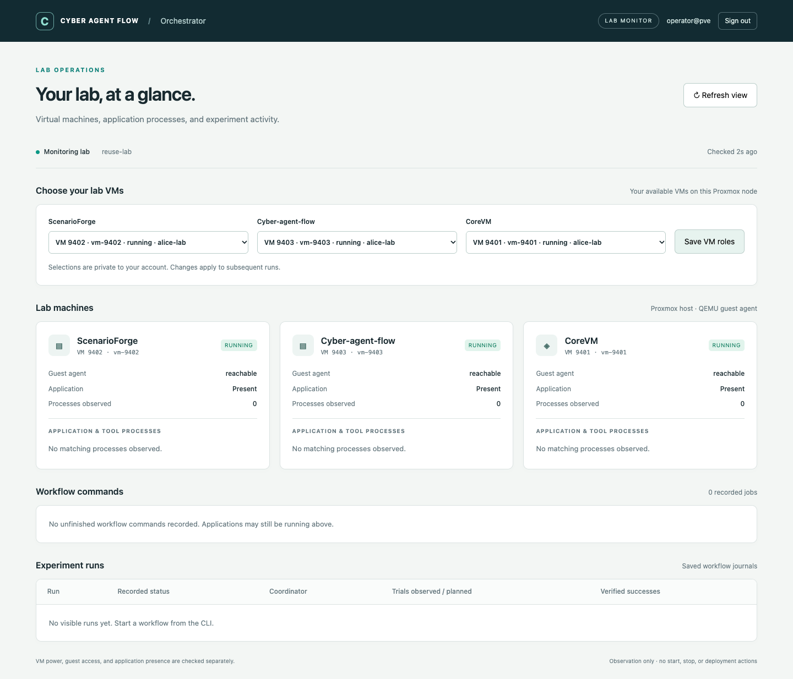

# Live lab dashboard

The WebUI monitors labs and saves per-user VM role selections in PVE mode.
Use the CLI to run, resume, recover and export experiments. The page shows VM availability, application presence,
process commands and elapsed time, unfinished workflow jobs, and saved run status.



The screenshot uses simulated data for browser verification, not a live Proxmox run.

## Start it

On the Proxmox host, after `uv sync`:

```bash
uv run cyber-agent-flow-orchestrator
```

This defaults to `serve`, `workflow.yaml`, `web.yaml`, and `runs/` in the current
directory. Missing default configuration files are created once; missing
certificate pairs are generated on first launch in `/certs`. PVE login is the
default, using the host FQDN, Proxmox CA and `caf-orchestrator` group.
Use [PVE login](pve-login.md) to enroll accounts, then choose VM roles in the page.
For local accounts instead, follow [HTTPS and login setup](https-login.md).
Explicit overrides remain supported:

```bash
uv run cyber-agent-flow-orchestrator serve examples/02-deploy-evaluate.yaml --runs-root runs --web-config examples/web.local.yaml
```

Open **https://localhost:8443** and sign in. For direct LAN access, use
`examples/web.lan.yaml` with your hostname and certificate. Loopback access through
an SSH tunnel remains available. TLS and authentication are mandatory in both modes;
the previous unauthenticated HTTP `serve --port` interface has been removed.
The backend remains loopback-only and accepts requests only from its paired proxy.

For future local macOS/Linux/Windows operation, a direct loopback WebUI without
PVE, login, or the HTTPS proxy is planned. It is not implemented yet; see the
[local deployment requirements](interfaces.md#planned-local-desktop-deployment).

The selected workflow YAML and its runtime must validate. `--runs-root` is a host
path relative to the current working directory; it need not exist until you start
a run. The workflow YAML supplies a template; PVE users choose their VM roles
in the page, while local-account mode uses the configured VM IDs. Starting/stopping the WebUI does not start/stop experiments or VMs.
Use a second terminal for ordinary CLI runs. Restart the WebUI after editing its
configuration.

To reuse ScenarioForge VM IDs and model settings, add
`--provision-config /path/to/scenarioforge-lab.conf`. This creates a separate
profile and initializes eligible roles once per user; saved selections are
preserved. See [provision import](provision-config.md).

## Select machines and application checks

In PVE mode, **Choose your lab VMs** lists only your available QEMU VMs on the
current node. Save your ScenarioForge, participant and CoreVM selections; they
persist for your account and the dashboard refreshes automatically. Revoked or
unavailable selections are omitted. Access is rechecked on save, before each host
operation, and before returning the current VM view.

The runtime template still specifies guest paths and defaults. In local-account
mode its settings directly select the app and participant VMs:

```yaml
backend:
  type: proxmox
  app_vmid: 9402
  participant_vmid: 9403
  user: participant
engine:
  path: /opt/cyber-agent-flow
  python: /opt/cyber-agent-flow/venv/bin/python
```

Add optional monitoring settings to the **workflow YAML**:

```yaml
monitoring:
  core_vmid: 9401
  scenarioforge_path: /opt/scenarioforge
  scenarioforge_service: scenarioforge-web.service
  core_service: core-daemon.service
  # Set only if you installed CAF as a named systemd service:
  # caf_service: cyber-agent-flow.service
```

CoreVM must be distinct from the app and participant VMs. If omitted, its card
shows “not configured”; the monitor does not guess its VM ID. `core_vmid` is for
observation only. ScenarioForge still uses its own CORE deployment connection;
reset/readiness hooks still select their own VM IDs.

For ScenarioForge, the path defaults to `scenarioforge.repo` for execute workflows
and `/opt/scenarioforge` otherwise. Its default service is the provisioner's
`scenarioforge-web.service`. CAF is checked at `engine.path`; no CAF systemd service
is assumed. Its WebUI does not need to run for evaluator workers to operate.
CORE defaults to `core-daemon.service`.

## What the indicators mean

| Indicator | Evidence / limitation |
| --- | --- |
| VM power | `qm status VMID --verbose 1` on the current Proxmox node; paused emulator state is shown separately |
| Missing | Proxmox explicitly reports a missing VM configuration; command/permission failures remain unknown |
| Guest agent reachable | A bounded Python inspection command succeeded through QEMU Guest Agent |
| Application present | CAF/SF marker file exists at the configured path; CORE executable or configured service is found |
| Application/tool process | Linux process matched the configured application path/module, a monitored service PID, or its descendants |
| Process elapsed time | Guest `/proc` start time and uptime, displayed as elapsed seconds/minutes/hours |
| Workflow command running | The journaled transient systemd unit is currently active and not exited |
| Command unconfirmed | Journal says unfinished, but no live confirmation is available; it is not assumed to be running |
| Recorded run status | Saved workflow journal, shown separately from the coordinator lock and live guest observations |

The guest probe reads files, process metadata and systemd status. It does not scan
the scenario network, call a model, start an application, inspect application
credentials/environment variables, or mutate lab services. Application presence
and process observations do **not** prove HTTP/API health, model availability,
CORE session readiness, or challenge reachability. Run the existing readiness and
backend checks for those purposes.

Process matching also includes shells/tools running from the configured application
checkout. Up to 40 matching processes are returned per VM, and up to 12 service units
are inspected per poll. Extra jobs remain unconfirmed. This is not a full system
process explorer. The selection list is filtered to the current node.

The monitor uses Proxmox's documented [qm status command](https://github.com/proxmox/pve-docs/blob/master/generated/qm.1-synopsis.adoc).
All VM operations still target the current node; multiple Proxmox hosts and other
hypervisors are not implemented here.

## Refresh and timing

A background monitor polls the three VM roles concurrently. The default pause
between probe batches is 10 seconds (`--poll-seconds`, minimum 2, maximum 300).
Guest checks have timeouts. PVE HTTP requests revalidate access and may schedule
a bounded background refresh for that user; host probes run off the request path.
Each user has a separate cached snapshot. Local-account requests read the existing
shared cache. The browser reads the cache every 3 seconds;
“Refresh view” reads the latest cache immediately. Check age and stale/unavailable
indicators distinguish fresh results from the last successful observation.

Elapsed process clocks advance between observations; exited processes disappear
on the next successful poll. Unconfirmed job timers do not advance in the browser.
New workflow, worker and per-trial-hook journals include command arguments and
start timestamps. When a live service start timestamp is available, the UI uses
the guest's monotonic clock. Host journal timing is explicitly labeled and includes
dispatch/setup time. Older journals may show unavailable commands or timing.

Command arguments can contain private data. Common password/token flags,
Authorization headers and URL credentials are masked for display, but this is
best-effort redaction. Do not treat the dashboard as a sanitized public report.
Private evaluator answers and prompts are not loaded into the dashboard API.

## Validation

```bash
uv run --group dev pytest -q
# Optional browser check; Chrome must be installed:
uv sync --group dev
uv run --group dev python tests/browser_smoke.py /tmp/caf-dashboard-preview
```

Tests cover VM absence/unknown/paused states, unreachable guest agents, process
matching/elapsed time, secret masking, live versus unconfirmed jobs, configuration
validation, HTTP endpoints, Host/Origin restrictions, cached reads, and the existing
workflow services. Browser checks use simulated data and exercise desktop/mobile
layout, advancing clocks, failure states and inert rendering of command strings.
A live Proxmox end-to-end validation remains outstanding.

## Private experiment results

Use `user-run` / `user-resume` with the same absolute runs root as the WebUI and
authenticate as the experiment owner. See the [README](../README.md#multiple-pve-users)
for commands. Only that account's run directory is listed; click a run for its
results. A caller cannot choose another owner's directory or supply an absolute
path to the API. Results are private to the owner; no project-sharing UI exists.
On an authorization/service error the browser clears displayed private data.
Legacy unowned runs and other users' runs are not shown.
