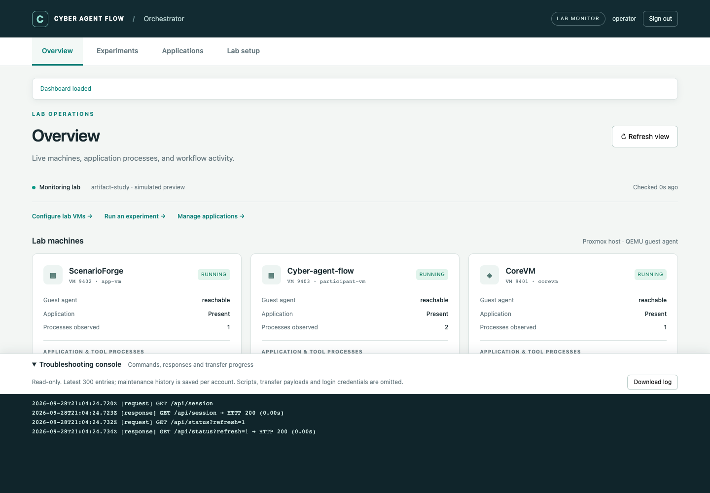
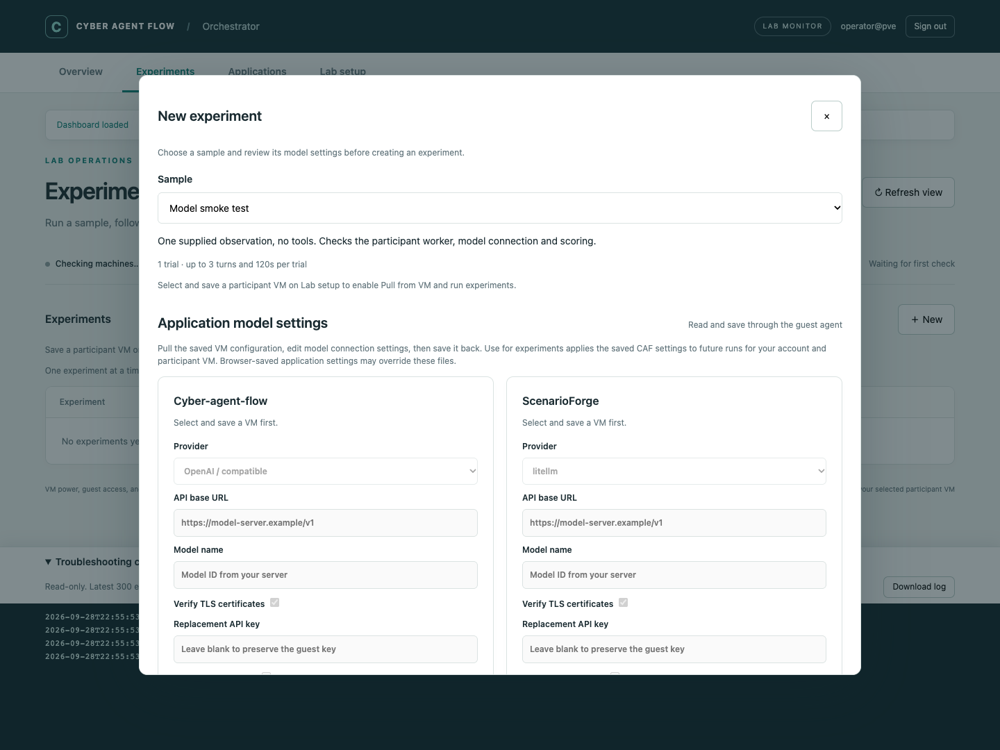
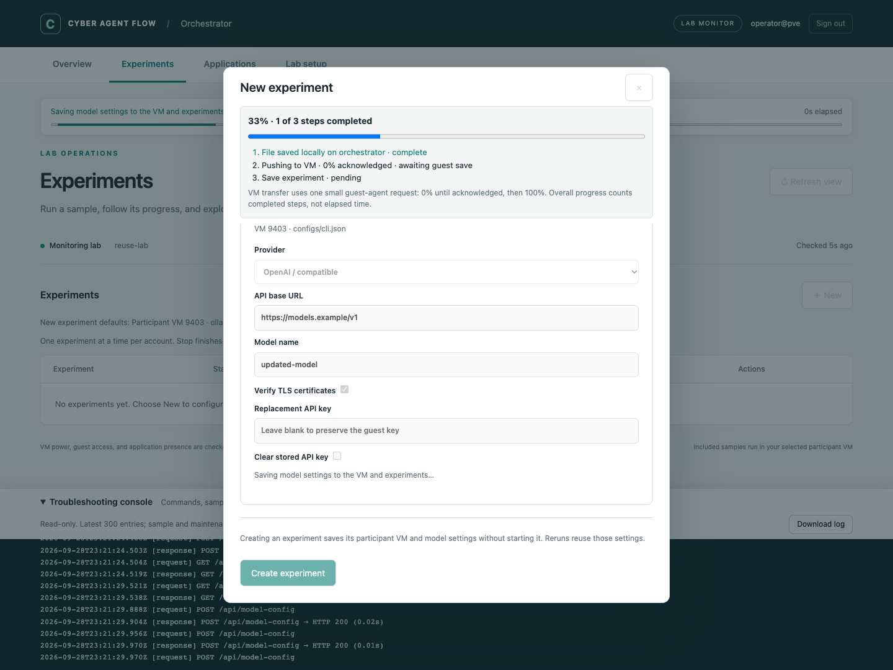
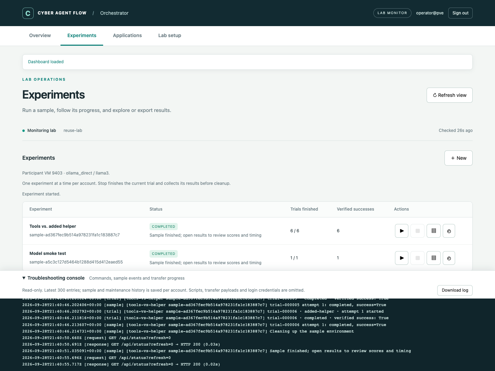
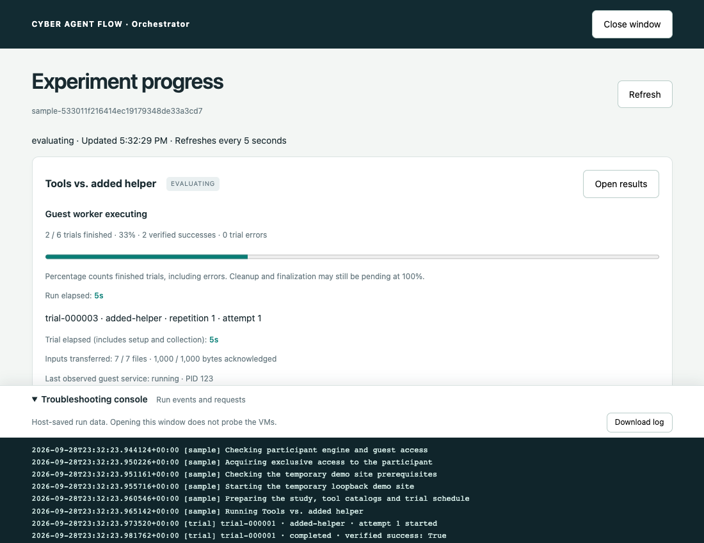
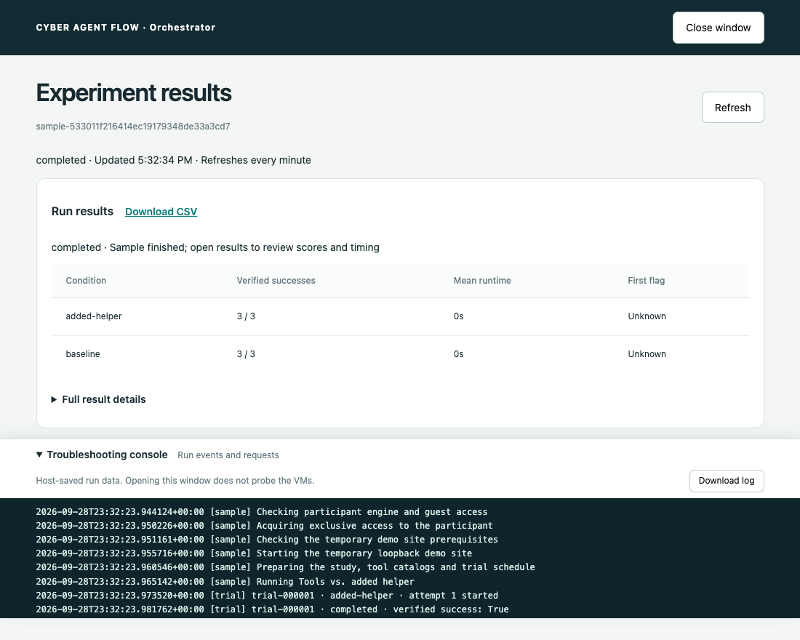

# Live lab dashboard

The WebUI monitors labs and saves per-user VM role selections in PVE mode.
It can launch [two bundled samples](../README.md#run-bundled-samples-in-the-webui)
and download their CSV datasets. Use the CLI for full workflows, resume, recovery
and other exports. The page shows VM availability, application presence,
process commands and elapsed time, unfinished workflow jobs, and saved run status.



The screenshot uses simulated data for browser verification, not a live Proxmox run.

## Pages and navigation

- **Overview** (`/#overview`): VM power, guest-agent access, application processes,
  elapsed time and unfinished workflow commands. Links lead to setup, experiments
  and application maintenance.
- **Experiments** (`/#experiments`): an experiment table with Run, Stop, View results
  and Open progress icons. **New** opens a sample configuration modal. Condition
  summaries and CSV downloads are available in a separate results window; full JSON is under
  **Full result details**. **Download Markdown summary** and **Download HTML report + charts** provide shareable run reports with task and system prompts, configured and observed tools, trial outcomes, stage/trial timing, scores, hints, flag progress and reported usage. HTML embeds its charts and opens offline; Markdown uses the companion `experiment-charts.svg`. All three files are also included in the run ZIP and CLI result export. Reports use the latest attempt per trial for comparisons and mark unavailable metrics explicitly.
- **Applications** (`/#applications`): version checks, Update with process-stop
  confirmation, rollback and the latest maintenance outcome. Expand **Maintenance
  history** for older jobs, transfer details and diagnostic records.
- **Lab setup** (`/#setup`): saved per-user VM roles and automatic refresh preferences.
  Local-account mode continues to use VM roles from the workflow configuration.

Navigation stays available during loading and maintenance. Switching pages does
not restart checks, submit changes, clear the console, or discard unsaved form
selections. The current page supports bookmarks, reload and browser Back/Forward.
Unsaved edits persist across page navigation, not a full browser reload. Loading
and maintenance status stays visible across pages; mutation controls retain their
existing busy and permission checks. Configure VM roles first, check application
compatibility on Applications, then run samples on Experiments.

## Start it

On the Proxmox host, after `uv sync`:

```bash
uv run cyber-agent-flow-orchestrator
```

This defaults to `serve`, `workflow.yaml`, `web.yaml`, and `runs/` in the current
directory. Missing default configuration files are created once; missing
certificate pairs are generated on first launch in `./certs`. PVE login is the
default, using the host FQDN, Proxmox CA and `caf-orchestration` group.
Use [PVE login](pve-login.md) to enroll accounts, then choose VM roles in the page.
For local accounts instead, follow [HTTPS and login setup](https-login.md).
Explicit overrides remain supported:

```bash
uv run cyber-agent-flow-orchestrator serve examples/02-deploy-evaluate.yaml --runs-root runs --web-config examples/web.local.yaml
```

Open **https://localhost:8443** and sign in. For direct LAN access, use
`examples/web.lan.yaml` with your hostname and certificate. Loopback access through
an SSH tunnel remains available. TLS and authentication are mandatory in both modes;
the previous unauthenticated HTTP `serve --port` interface has been removed.
The backend remains loopback-only and accepts requests only from its paired proxy.

For future local macOS/Linux/Windows operation, a direct loopback WebUI without
PVE, login, or the HTTPS proxy is planned. It is not implemented yet; see the
[local deployment requirements](interfaces.md#planned-local-desktop-deployment).

The selected workflow YAML and its runtime must validate. `--runs-root` is a host
path relative to the current working directory; it need not exist until you start
a run. The workflow YAML supplies a template; PVE users choose their VM roles
in the page, while local-account mode uses the configured VM IDs. Starting the
WebUI does not start experiments or VMs. Stopping it asks sample workers to finish
the current bounded trial and clean up; independent CLI runs are unaffected.
Use a second terminal for ordinary CLI runs. Restart the WebUI after editing its
configuration.

To reuse ScenarioForge VM IDs and model settings, add
`--provision-config /path/to/scenarioforge-lab.conf`. This creates a separate
profile and initializes eligible roles once per user; saved selections are
preserved. See [provision import](provision-config.md).

## Loading and progress

The login form locks its fields and buttons while authentication is pending, and
keeps them locked while navigating after success. Duplicate submissions are
ignored. The dashboard verifies its session before requesting VM status.

During initial/manual dashboard retrieval and VM checks, role saves, result loading
and application maintenance, edit/submit/refresh controls are disabled. Scheduled
background refreshes keep controls usable. If you submit an action during an
in-flight background read, it waits for that read before dispatching; duplicate
submissions are blocked. A status banner shows the
current step and elapsed time. VM-check percentages count finished checks for the
currently authorized selected VMs (for example, 1 of 3 is 33%); they are not an
estimate of remaining time or a claim that every VM is healthy. Authentication,
HTTP requests and maintenance operations use an indeterminate indicator and their
current status because their total work is unknown. Maintenance details remain
readable while an operation is active.

Manual **Refresh view** updates the dashboard using short-lived VM observation caches in PVE mode. **Recheck VMs** bypasses those caches for a fresh scan. **Lab setup → Automatic refresh**
offers Never or every 1, 2, 5, or 10 minutes, defaulting to 1 minute. The preference
is saved in this browser and can be changed while a check is running. Never stops
periodic page refreshes; it does not cancel a check or job already started. With
Never selected, active experiments receive quiet, read-only completion checks every
five seconds. Only a terminal outcome updates the dashboard experiment row,
without a loading modal. These checks stop once the experiment finishes and do not
start VM probes. With automatic refresh enabled, active operations report progress
every five seconds.
Automatic reads do not overlap, and polling pauses during a save or other
foreground action. On a request
failure, controls unlock for retry; temporary service errors do not themselves
send the user back to login. A confirmed expired session still requires login.
Experiment jobs continue in the background with their existing run controls.

## Application versions

On **Applications**, use **Check version**, **Update** and **Roll back** for the selected CAF and
ScenarioForge VMs. Updating/rolling back requires the `caf-maintainers` PVE group;
checking versions uses ordinary VM access. Updates run in background workers and
preserve local data. See [application maintenance](application-updates.md) for
setup, dependency limits, service restarts, source repositories and recovery.

## Troubleshooting console

The collapsible console is fixed to the bottom of the viewport on every workspace
page, with its own scroll area. Page content can scroll fully above the dock.
Navigation preserves the same console and scroll position. It shows dashboard API request/status timing
and maintenance activity: host Git commands and their bounded output, guest-agent
operations, `qm` execution/status responses, authorization timing and file-transfer
acknowledgements. It is read-only. Hide/show is saved in this browser, and
**Download log** exports the displayed text. Both remain usable during loading or
maintenance. The view follows new entries when scrolled to the bottom; scroll up
to keep reading older entries.

During a source upload, the maintenance card shows acknowledged bytes, percentage,
average KiB/s and the last acknowledgement time. This percentage describes the
file transfer, not the whole update. Reaching 100% written is followed by a guest
size/SHA-256 check, then application validation and activation. No new acknowledgement
means the current command or authorization check may still be waiting; consult the
timestamped console. Evaluator 0.4.2+ uses 512 KiB stdin upload blocks and synchronous
write acknowledgements to reduce round trips. Downloads still use 16 KiB blocks.
Fresh per-dispatch permission checks and full-file checksum verification remain;
see [upload performance and installation](application-updates.md#upload-performance).

Maintenance traces are private to the signed-in account, persisted as
`RUNS_ROOT/_users/<owner-hash>/updates/<job-id>/console.json`. Each file keeps the
latest 100 events; the dashboard reads traces for the latest three jobs and shows
at most 300 entries together with browser requests. Browser-only request entries
reset on reload. Old jobs started before this update have no trace. Trace events
arrive with active-operation status reads (normally every five seconds).

The console omits login bodies, cookies/headers, guest-helper source, RPC file
contents and base64 payloads. Responses use selected metadata and common credential
patterns are masked in host command output. Redaction is best effort: review an
export before sharing it. This is not a full shell transcript or an agent
prompt/response log; inner guest commands are represented by their guest operation
and its result, and captured host Git output appears when that command finishes.
Session/access errors clear the private console view along with the dashboard.

## Bundled samples

See the [illustrated sample guide](bundled-samples.md) for a figure and detailed
explanation of what each included experiment does and measures.

Choose **New**, select either bundled sample, and press **Create experiment**.
The modal shows its description, trial budgets, current experiment model and
CAF model settings. **Pull from VM** reads its current saved configuration;
**Create experiment** saves the loaded/edited settings to the VM, then creates a
**Ready** row with its participant VM and model configuration, without starting it.
If saving fails, no row is created and the modal shows the error for retry. The
modal shows **Saving file locally**, **Pushing to VM**, and **Saving experiment**.
The local draft lives on the orchestrator, excludes API keys, and does not replace
active defaults until the VM save succeeds. VM push progress goes from **0% awaiting
acknowledgement** to **100% saved**: this small config uses a single guest-agent
request, so intermediate byte percentages are unavailable. Overall progress counts
completed steps (0/3 through 3/3), not time. Failures retain the completed steps and
mark the failed stage; retry starts a fresh progress display. Without
pulling, creation uses current experiment defaults. Reruns retain that configuration and credential
reference instead of adopting newer defaults. If no VM is selected when creating
the row, its configuration is captured on first run. Legacy rows without a saved
runtime also capture settings on their next run.





Each row has four labeled icon buttons:

| Icon | Action |
| --- | --- |
| ▶ | Run a ready experiment, or run a finished experiment again in a new row |
| ■ | Stop after the current bounded trial, collect its output and clean up |
| ▤ | View results already saved on the orchestrator host, including failed runs |
| ◴ | Open the selected run's progress window |



Before scenario preparation, a VM preflight reserves the selected VMs and checks
for leftover CAF services. It stops jobs recorded in inactive runs, including
evaluation workers and preparation hooks, while preserving their files and logs.
An active run or an unrecognized active CAF service blocks startup. The Progress
window shows the readiness and cleanup outcome for each VM.

Only one experiment can run per account at a time. The server enforces this
across browser tabs, and Run buttons stay disabled during execution and cleanup.
Stop changes the status to **Stopping** until the current trial finishes and
cleanup completes. It does not immediately kill a model request or worker.
A stopped run retains its collected results with status **Cancelled**; rerunning
creates a separate run and preserves the original. Trials that never started
have no output to collect.

**Open progress** opens a separate browser window for the selected run. Starting
or stopping a run provides an Open progress link. Closing the window does not stop
execution. You can keep Results and Progress beside the dashboard, or close the
dashboard and leave either window open. Each window has its own persistent
troubleshooting console. Browser preferences may open a tab instead of a window;
if popups are blocked, the dashboard offers a new-tab link.



- Preparation steps: participant checks, exclusive access, demo-site setup, and
  study/catalog preparation.
- Finished trials out of the planned total, verified successes and execution
  errors. The percentage counts terminal trials, including errors, not elapsed
  budget, model tokens, or the probability of success.
- Current trial ID, condition, repetition, attempt, elapsed time and configured
  turn/time limits. Trial elapsed includes preparation and output collection;
  the worker budget applies to execution and is not an end-to-end ETA.
- Guest stage, input files/bytes transferred, last observed service state/PID,
  and when that stage was last recorded, when supported by the host evaluator.
- Per-trial outcomes and scores, recent timestamped events, and a link to results.
- Recorded trial errors appear directly below the trial table and in results.
  Both windows refresh saved host data every 5 seconds during active execution
  and every minute after completion; Refresh reloads immediately. These reads
  do not start VM checks or fetch outputs from the participant. PVE session/access
  checks still apply.

**View results** opens a separate window with condition summaries, trial errors,
CSV download and expandable full JSON. Use **Close window** or the browser window
controls to close it. Reopening the same view for a run reuses its named window.
URLs can also be reloaded or opened directly while signed in:
`/run?view=results&run=<run-id>` and `/run?view=progress&run=<run-id>`.



Failed attempts also show **Failure details** from files already collected on
the host: model-call error messages and expandable **Collected worker log** tails.
This works for existing failed runs after updating the orchestrator; no rerun or
VM connection is required. Model-call previews include only the error, not request
or response bodies. Common credential fields are redacted. Previews cover up to
20 failed attempts, the last 10 call records per output location, and the last
80 log lines (up to 12,000 characters). Missing or unreadable diagnostics are
reported explicitly; opening results does not attempt remote recovery.

A compact status notice follows the active sample across all pages. The full
panel and console update with five-second progress reads when automatic refresh
is enabled. Never keeps the displayed progress stable until experiment completion
or a manual refresh. Run/trial elapsed clocks advance between reads.
All guest stages come from host transport journals; viewing progress adds no
guest RPCs. Slow guest calls may leave a stage unchanged until they return.
Live model tokens, conversation turns and individual tool calls are not streamed;
verification scores appear after outputs are collected. A finished trial can fail
verification without being an execution error.

Trials can reach 100% while demo-site cleanup is pending. The run remains active
until cleanup finishes, and cleanup failures are reported as failures. If the
coordinator disappears, unfinished trials are marked unconfirmed and live clocks
stop. Older evaluator checkouts still show trial counts and timing, with a broader
guest-stage description. Update the host's `cyber-agent-flow-eval` checkout and
restart the orchestrator for detailed preparation/execution/collection stages;
there is no new guest installation or API compatibility requirement.

Sample events are recorded in each owner's run journal and derived from trial
and transport records. The console includes the latest three sample runs along
with maintenance traces and browser requests, bounded to the latest 300 entries.
Progress includes identifiers and outcomes, not prompts, answers, credentials,
or worker command arguments.

Select and save ScenarioForge, participant and CoreVM roles before creating a sample. The fixed XML/bundle and evaluation controls are visible and greyed out. CAF's effective runtime/model configuration is shown separately; model settings can be edited with the existing maintenance permissions.

Creating a sample imports its fixed package. Run prepares deterministic topology and fresh task secrets, deploys on CORE, checks readiness, exports tasks/verifiers, then evaluates CAF. Results and progress retain owner-scoped access. See [demo profile](demo-profile.md) for tasks and [scenario experiments](scenario-experiments.md) for configuration.

### Sample lifecycle and recovery

Runs use the existing workflow coordinator, target reservations and participant locks. All guest calls require current PVE access. One experiment per account and two per server may run. Stop requests take effect at stage/trial boundaries; deployed scenarios remain in place. Interrupted runs retain their journals and artifacts; use authorized workflow recovery before rerunning when necessary. New runs preserve prior results and generate fresh challenge secrets.

Set `samples: [smoke]` or `samples: []` to restrict new samples; existing results remain available. Historical participant-local samples keep their saved configuration and recovery behavior.

## Select machines and application checks

### Application model settings

After saving VM roles on Lab setup, open **Experiments → New**. Its
**Application model settings** section currently contains only Cyber-agent-flow:

- **Pull from VM**, next to the Cyber-agent-flow card title, reads model connection fields from
  `<engine.path>/configs/cli.json` through QEMU guest exec. A missing file can be
  created when you press Create experiment.
- **Create experiment** first saves provider, base URL, model, TLS verification and optionally the
  API key in the VM, and adopts them for this account and participant VM in one
  action. It preserves unrelated JSON values, including network scope and tools.
  An existing file gets a private `.caf-model-<id>.bak` backup before atomic
  replacement. A changed file or VM selection invalidates the loaded draft;
  pull again to continue.
  It then captures the selected VM and runtime, including model
  settings and the guest credential reference. Both its first run and subsequent
  reruns use this snapshot. Reruns still require current access to the saved VM;
  changing the Lab setup selection does not silently move an old experiment.
  Create a new experiment to use changed settings. Existing `user-run`
  materialization uses the defaults saved during creation; standalone evaluator and unscoped CLI runs
  continue to use explicit YAML.

For an OpenAI-compatible server, select **OpenAI / compatible** (`openai`). The
base URL generally includes `/v1`, and the model name must match the server.
The URL is used inside the participant VM and must be reachable from there.

Pulling shows only whether a file contains an API key. Enter a replacement to
change it, leave the field empty to preserve it, or explicitly select **Clear
stored API key**. Keys travel through `qm --pass-stdin` and are not returned in the
browser response, host preference files, or troubleshooting console. The application
file and backups are mode 0600 with the original owner. When saving CAF settings
with a stored key, the guest creates a separate immutable mode-0600 EnvironmentFile
under `/var/lib/caf-model-config/`; the host stores only its path and variable name.
These snapshots are retained so old runs can continue to reference them.

If CAF uses an environment-only key, its `api_key_env` name is adopted and the
runtime's existing guest `backend.environment_file` remains in use. A key exported
only in an interactive terminal is not inherited by the systemd evaluation worker.
Either configure that guest EnvironmentFile or save a replacement key through this
editor. Clearing the file's key does not clear an independently configured environment.

Reading requires access to the selected VM. Saving additionally requires
the configured application maintenance group (default `caf-maintainers`); `updates:
false` disables writes. Mutations refuse while the VM's evaluator lock or guest
maintenance lock is held. No application restart is automatic: open a new CAF
session or restart a long-running app as appropriate. CAF browser-saved settings,
explicit CLI flags and process environment are not imported or overwritten by
this file editor and can take precedence for interactive app sessions.

In PVE mode, **Choose your lab VMs** lists only your available QEMU VMs on the
current node. Save your ScenarioForge, participant and CoreVM selections; they
persist for your account and the dashboard refreshes automatically. Revoked or
unavailable selections are omitted. Access is rechecked on save, before each host
operation, and before returning the current VM view.

The runtime template still specifies guest paths and defaults. In local-account
mode its settings directly select the app and participant VMs:

```yaml
backend:
  type: proxmox
  app_vmid: 9402
  participant_vmid: 9403
  user: participant
engine:
  path: /opt/cyber-agent-flow
  python: /opt/cyber-agent-flow/venv/bin/python
```

Add optional monitoring settings to the **workflow YAML**:

```yaml
monitoring:
  core_vmid: 9401
  scenarioforge_path: /opt/scenarioforge
  scenarioforge_service: scenarioforge-web.service
  core_service: core-daemon.service
  # Set only if you installed CAF as a named systemd service:
  # caf_service: cyber-agent-flow.service
```

CoreVM must be distinct from the app and participant VMs. If omitted, its card
shows “not configured”; the monitor does not guess its VM ID. `core_vmid` is for
observation only. ScenarioForge still uses its own CORE deployment connection;
reset/readiness hooks still select their own VM IDs.

For ScenarioForge, the path defaults to `scenarioforge.repo` for execute workflows
and `/opt/scenarioforge` otherwise. Its default service is the provisioner's
`scenarioforge-web.service`. CAF is checked at `engine.path`; no CAF systemd service
is assumed. Its WebUI does not need to run for evaluator workers to operate.
CORE defaults to `core-daemon.service`.

## What the indicators mean

| Indicator | Evidence / limitation |
| --- | --- |
| VM power | `qm status VMID --verbose 1` on the current Proxmox node; paused emulator state is shown separately |
| Missing | Proxmox explicitly reports a missing VM configuration; command/permission failures remain unknown |
| Guest agent reachable | A bounded Python inspection command succeeded through QEMU Guest Agent |
| Application present | CAF/SF marker file exists at the configured path; CORE executable or configured service is found |
| Application/tool process | Linux process matched the configured application path/module, a monitored service PID, or its descendants |
| Process elapsed time | Guest `/proc` start time and uptime, displayed as elapsed seconds/minutes/hours |
| Workflow command running | The journaled transient systemd unit is currently active and not exited |
| Command unconfirmed | Journal says unfinished, but no live confirmation is available; it is not assumed to be running |
| Recorded run status | Saved workflow journal, shown separately from the coordinator lock and live guest observations |

The guest probe reads files, process metadata and systemd status. It does not scan
the scenario network, call a model, start an application, inspect application
credentials/environment variables, or mutate lab services. Application presence
and process observations do **not** prove HTTP/API health, model availability,
CORE session readiness, or challenge reachability. Run the existing readiness and
backend checks for those purposes.

Process matching also includes shells/tools running from the configured application
checkout. Up to 40 matching processes are returned per VM, and up to 12 service units
are inspected per poll. Extra jobs remain unconfirmed. This is not a full system
process explorer. The selection list is filtered to the current node.

The monitor uses Proxmox's documented [qm status command](https://github.com/proxmox/pve-docs/blob/master/generated/qm.1-synopsis.adoc).
All VM operations still target the current node; multiple Proxmox hosts and other
hypervisors are not implemented here.

## Refresh and timing

The browser's **Automatic refresh** setting controls idle status requests and new
PVE VM-check batches. Intervals start after the preceding check/action completes;
slow calls never pile up. A page load, a saved role change or **Refresh view** also
requests PVE VM checks using short-lived observation caches. The three roles are checked concurrently with bounded
guest timeouts, off the HTTP request path. Every read still revalidates access.
Each user has a separate cached snapshot. `/api/status?refresh=0` reads progress
without scheduling probes; `?refresh=1` requests a batch if none is running.
Guest application/process observations are cached for 60 seconds, or five seconds
when workflow jobs are active; power observations are cached for five seconds.
Cached guest observations retain their original timestamp and are labeled in VM
cards. **Recheck VMs** (`?refresh=1&fresh=1`) bypasses observation caches.
Completed experiment summaries are reused for up to five minutes, invalidated
when workflow/evaluation data changes or a coordinator becomes active. Active
experiment status and access checks remain fresh.
The unqualified status API retains the server cache interval (`--poll-seconds`,
default 10, minimum 2, maximum 300 seconds).

In legacy local-account mode, the shared server monitor still runs on
`--poll-seconds`; the browser setting controls only how often its cache is read.
Check age and stale/unavailable indicators distinguish the last successful
observation from current activity. Never still loads once when the page opens,
and you can use **Refresh view** at any time the dashboard is idle.

Elapsed process clocks advance between observations; exited processes disappear
on the next successful poll. Unconfirmed job timers do not advance in the browser.
New workflow, worker and per-trial-hook journals include command arguments and
start timestamps. When a live service start timestamp is available, the UI uses
the guest's monotonic clock. Host journal timing is explicitly labeled and includes
dispatch/setup time. Older journals may show unavailable commands or timing.

Command arguments can contain private data. Common password/token flags,
Authorization headers and URL credentials are masked for display, but this is
best-effort redaction. Do not treat the dashboard as a sanitized public report.
Private evaluator answers and prompts are not loaded into the dashboard API.

## Validation

```bash
uv run --group dev pytest -q
# Optional browser check; Chrome must be installed:
uv sync --group dev
uv run --group dev python tests/browser_smoke.py /tmp/caf-dashboard-preview
uv run --group dev python tests/browser_navigation.py /tmp/caf-navigation-preview
```

Tests cover VM absence/unknown/paused states, unreachable guest agents, process
matching/elapsed time, secret masking, live versus unconfirmed jobs, configuration
validation, HTTP endpoints, Host/Origin restrictions, cached reads, and the existing
workflow services. Browser checks use simulated data and exercise desktop/mobile
layout, advancing clocks, failure states and inert rendering of command strings.
Navigation checks cover page history and reload, retained form edits and console
content, console visibility during loading, collapse persistence, and content
clearance above the console on desktop and mobile. Navigation adds no API requests.
A live Proxmox end-to-end validation remains outstanding.

## Private experiment results

Use `user-run` / `user-resume` with the same absolute runs root as the WebUI and
authenticate as the experiment owner. See the [README](../README.md#multiple-pve-users)
for commands. Only that account's run directory is listed; click a run for its
results. A caller cannot choose another owner's directory or supply an absolute
path to the API. Results are private to the owner; no project-sharing UI exists.
On an authorization/service error the browser clears displayed private data.
Legacy unowned runs and other users' runs are not shown.

## Dashboard timeouts after selecting VMs

HTTP 504 means the HTTPS proxy timed out waiting for the dashboard backend; it
is not a PVE permission-denied response. Earlier versions used a 15-second total
request deadline and repeated inventory/group checks for each selected VM. A
three-VM save could exceed that deadline on a slower PVE API.

Role saves now share one fresh inventory check while checking each VM's effective
ACL, then recheck account/group access before saving. There is no authorization
cache across requests or guest commands. The proxy allows 60 seconds for a full
request; individual PVE requests retain their four-second socket timeout. Guest
probes run in the background, so slow guest agents do not hold the status response.

Update and restart the orchestrator to apply these changes. If a save times out,
refresh to check whether it completed before saving again. The page clears private
observations when it cannot verify access, and distinguishes a timeout from an
explicit denial. Persistent 504s produce `Dashboard backend timed out` in the
server output with the method/path, without credentials. Check that the PVE API
at `auth.url` is responding promptly; do not broaden ACLs or disable TLS validation
to work around a timeout.

Regression tests cover all three roles over HTTPS with blocked guest probes,
per-VM ACL denial, group revocation during a batch, and the reduced PVE call count.

The optional slow-response browser regression checks locked login/role/refresh
controls, duplicate-submission suppression, measured 0/33/67/100 VM progress,
nonoverlapping requests, transient-error recovery and mobile layout:

```bash
uv run --group dev python tests/browser_loading.py /tmp/caf-loading-preview
uv run --group dev python tests/browser_refresh.py /tmp/caf-refresh-preview
```

The Progress window shows the saved workflow timeline: XML verification, preparation, ScenarioForge deployment/readiness/export, package download, readiness validation, reproduction capture, configuration freeze, evaluation-plan import and agent trials. Each stage shows its VM, state, elapsed time, timestamps, attempts, saved log path and any failure. VM cards describe each role. Workflow-stage counts and trial completion are separate; neither is an estimate of time remaining.

Download counters report bytes received by the existing guest-agent transfers and mark verification only after checksum validation. During guest commands, the coordinator records QGA responses and reads up to 8 KiB of new command output every ten seconds. Partial command logs are saved on the host while execution is active; redacted excerpts appear in the troubleshooting console. A thirty-second heartbeat reports elapsed time, collected log bytes and the configured command limit even when output is quiet. Demo preparation reports backend loading, asset copying, CORE settings, topology planning and evaluation-task creation; Python demo/deployment commands run unbuffered. ScenarioForge output exposes its reported CORE operations; live model/tool calls are not streamed. Status and results requests only read host-saved data and never initiate these VM reads. Participant upload counters and service state come from evaluator transport checkpoints. Progress is retained in workflow/results JSON and the run bundle. Older runs without stage timestamps retain their recorded stage states.

In **New → Evaluation**, sample task definitions are visible and locked. Custom experiments can preview ScenarioForge tasks, edit a copy, add/remove tasks or import a JSON task array. Create remains disabled for missing prompts, duplicate/invalid IDs, malformed criteria or missing readiness checks. Custom task definitions are frozen in the experiment XML and retained in reruns and downloads. See [scenario experiments](scenario-experiments.md#caf-and-evaluation-configuration).

When an experiment completes with errors, **Progress** and **Results** show an
**Experiment errors** section identifying each unsuccessful trial, condition,
status and recorded error. Missing error messages receive an explicit fallback.
Available collected worker log tails open automatically, and model-call errors
appear beside them. The experiment table shows a trial error count. All of these
reads use saved host artifacts; an agent answer that fails verification while
execution completes is reported through the verified score, not a trial error.

Orchestrated experiments default to `execution.auto_approve_dangerous: true`,
CAF's Python equivalent of `--dangerous-no-prompt`. The flag is saved in the run
configuration and passed to the participant session. Network allow/disallow rules,
tool selection and wall-clock budgets still apply. The participant CAF checkout
must support this option and unattended continuation at tool timeout checkpoints.
Saved interaction events appear in Failure details with the decision type, tool
and timeout checkpoint; arguments and command bodies are omitted from this preview.

The creation loading modal displays server-reported steps and elapsed time. Sample
creation covers eight steps: validation, ScenarioForge connection, bundle transfer,
import, scenario validation, XML snapshot, CAF configuration and experiment storage.
Existing scenario selections use the final four steps. Progress reads are scoped to
the signed-in owner and request ID; they do not initiate guest operations.

The starting-experiment loading modal reports five server checkpoints: saved-run
validation, coordinator capacity, run configuration, VM access and launch-journal
storage, and coordinator submission. It shows elapsed time while the request is
pending. Once the coordinator accepts the run, the Progress view reports the
actual deployment and evaluation stages. Launch status is scoped to the owner and
request ID independently of creation status.

Every workflow stage has an expandable **Stage details and output** panel. Active
and failed stages open automatically; expansion choices persist while the window
is open. Panels show saved checkpoints, recent output, per-stage guest responses,
command limits/exit codes, checksum-verified transfer counts, saved artifact paths,
readiness checks and trial outcomes. Checkpoint history is retained per stage even
when the main console rolls over. Command previews show at most 60 lines, with
common credentials redacted. These views only read saved host data. Existing runs
can show their saved command logs and artifacts; new checkpoints require a new run.

Active Progress and Results windows poll their saved run data every five seconds,
independently of the dashboard Automatic refresh setting, including Never.
These updates run silently without reopening the loading modal. With Never set,
polling stops when the run finishes; dashboard VM observations remain unchanged.

When you save or use participant model settings, the orchestrator calls the
provisioner's `/usr/local/sbin/update-llm-destination` utility. It updates the
persistent Netplan route or DHCP route-service destination and reconciles only
its managed endpoint/gateway exclusions, preserving custom agent policy. The
Desktop shortcut uses this same utility. Model settings are not saved if route
validation or application fails; the utility restores its previous files/routes.

The save response shows the destination, interface, gateway, and a bounded TCP
connectivity check from the participant. An unreachable endpoint is saved with
a warning; the check does not validate credentials or model availability. Saved
experiments retain their original model settings. Create a new experiment to
use the new endpoint. Automatic route updates currently require a literal IPv4
address or a hostname resolving to one IPv4 address; multi-address and IPv6-only
endpoints are rejected before changing routes. Guests without the provisioner
helper explicitly report that their routes were unchanged.

If the endpoint hostname cannot resolve after the bootstrap NIC is removed,
the shared utility configures DNS for just that provider domain on the dedicated
LLM NIC, using its on-link configured/DHCP resolver or gateway. This setting is
persistent. DNS and route files are restored if route setup fails.
